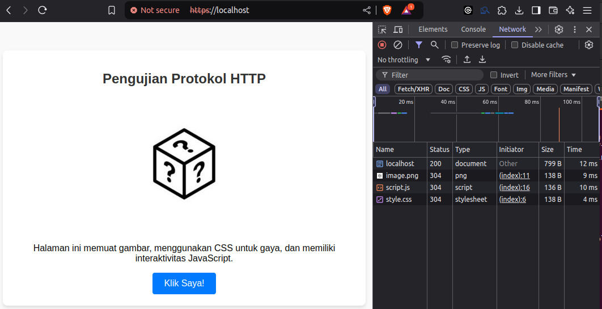
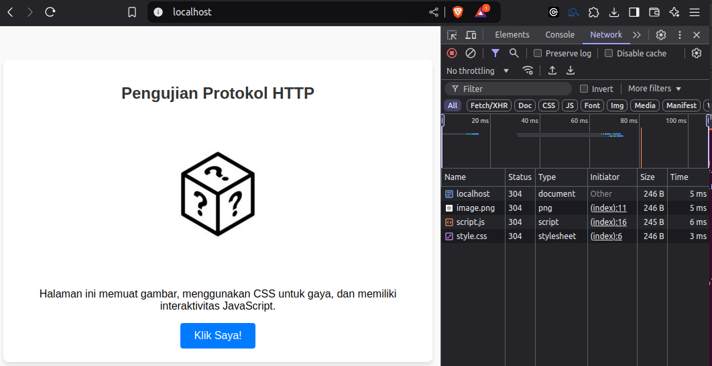

# Membuat Docker
Untuk menginstal web server berbasis Docker dengan dukungan HTTP/1.1, HTTP/2.0, dan HTTP/3.0, mengaksesnya melalui Chrome, dan menganalisis lalu lintas dengan Wireshark, berikut langkah-langkahnya:

---

### 1. **Persiapan Lingkungan**

- Pastikan Docker dan Wireshark telah terinstal di sistem Anda.
- Unduh dan instal browser Google Chrome versi terbaru.

---

### 2. **Konfigurasi Docker untuk Web Server**

Kita akan menggunakan **NGINX** sebagai contoh web server karena mendukung HTTP/1.1, HTTP/2, dan HTTP/3.

#### a. **Buat File Docker Compose**

Buat file `docker-compose.yml` dengan konfigurasi berikut:

```yaml
version: '3.8'
services:
  web:
    image: nginx:latest
    ports:
      - "80:80"       # HTTP/1.1
      - "443:443"     # HTTP/2 dan HTTP/3
    volumes:
      - ./conf.d:/etc/nginx/conf.d
      - ./certs:/etc/nginx/certs
      - /var/www/project_http:/var/www/project_http
```

#### b. **Buat File Konfigurasi NGINX**

Buat file `default.conf` di dalam direktori  `conf.d`:

```nginx
server {
   listen 80; # HTTP/1.1
   listen 443 ssl http2; # HTTP/2
   listen 443 quic reuseport; # HTTP/3
   ssl_certificate /etc/nginx/certs/server.crt;
   ssl_certificate_key /etc/nginx/certs/server.key;
   ssl_protocols TLSv1.3;
   ssl_prefer_server_ciphers off;
   add_header Alt-Svc 'h3-23=":443"; ma=86400';
   add_header X-Content-Type-Options nosniff;
   root /var/www/project_http;
   index index.html;
}
```

#### c. **Sertifikat SSL**

Buat sertifikat SSL untuk mendukung HTTPS:

```bash
mkdir certs
openssl req -x509 -newkey rsa:2048 -keyout certs/server.key -out certs/server.crt -days 365 -nodes
```

---

### 3. **Jalankan Web Server**

Di terminal, jalankan:

```bash
docker-compose up
```

---
#### 3.1 Aktifkan Firewall
```bash
ufw enable
ufw allow 80
ufw allow 443
```
cek konfigurasi
```bash
$ ufw status
Status: active

To                         Action      From
--                         ------      ----
80                         ALLOW       Anywhere                  
443                        ALLOW       Anywhere                  
80 (v6)                    ALLOW       Anywhere (v6)             
443 (v6)                   ALLOW       Anywhere (v6) 
```
jika hasil seperti diatas, maka konfigurasi telah berhasil.
### 4. **Akses di Chrome**

- Buka Chrome dan akses `http://localhost` untuk HTTP/1.1.
- Gunakan `https://localhost` untuk HTTPS dengan HTTP/2 dan HTTP/3.

---

### 5. **Pantau Lalu Lintas di Wireshark**

1. Buka Wireshark dan pilih jaringan yang Anda gunakan (misalnya, Wi-Fi atau Ethernet).
2. Gunakan filter:
    - **HTTP/1.1**: `http`
    - **HTTP/2**: `http2` atau `tcp.port==443`
    - **HTTP/3**: `udp.port==443`
3. Akses URL di Chrome dan amati lalu lintas di Wireshark.

---

### 6. **Verifikasi Versi HTTP di Chrome**

- Buka **Developer Tools** di Chrome (tekan F12).
- Pergi ke tab **Network**.
- Muat ulang halaman dan perhatikan kolom **Protocol** untuk melihat apakah koneksi menggunakan HTTP/1.1, HTTP/2, atau HTTP/3.

Dengan langkah-langkah ini, Anda bisa menjalankan web server NGINX dalam Docker, mengamati perilaku protokol HTTP di browser Chrome, dan menganalisis lalu lintas menggunakan Wireshark.

# Membuat Aplikasi Sederhana
Berikut adalah contoh sederhana dari sebuah halaman HTML yang berisi **CSS**, **JavaScript**, dan **gambar** untuk pengujian protokol HTTP/1.0, HTTP/2.0, dan HTTP/3.0. Semua file terkait (HTML, CSS, JavaScript, dan gambar) disusun secara terpisah untuk memastikan pemuatan multi-objek yang bisa diuji.

---

### **Struktur File**
Buat folder project
```bash
$ cd /var/www && mkdir project_http
$ cd project_http
```
struktur file
```
project_http/
├── index.html
├── style.css
├── script.js
├── image.png
```

---

### **1. index.html**

File HTML utama untuk menghubungkan CSS, JavaScript, dan gambar.

```html
<!DOCTYPE html>
<html lang="en">
<head>
    <meta charset="UTF-8">
    <meta name="viewport" content="width=device-width, initial-scale=1.0">
    <title>HTTP Protocol Testing</title>
    <link rel="stylesheet" href="style.css">
</head>
<body>
    <div class="container">
        <h1>Pengujian Protokol HTTP</h1>
        
        <p id="description">Halaman ini memuat gambar, menggunakan CSS untuk gaya, dan memiliki interaktivitas JavaScript.</p>
        <button id="testButton">Klik Saya!</button>
    </div>

    <script src="script.js"></script>
</body>
</html>
```

---

### **2. style.css**

File CSS untuk memberikan gaya pada halaman.

```css
body {
    font-family: Arial, sans-serif;
    text-align: center;
    background-color: #f9f9f9;
    margin: 0;
    padding: 0;
}

.container {
    padding: 20px;
    margin: 50px auto;
    max-width: 600px;
    background: #ffffff;
    border-radius: 8px;
    box-shadow: 0 4px 6px rgba(0, 0, 0, 0.1);
}

h1 {
    color: #333333;
    font-size: 24px;
}

.test-image {
    width: 200px;
    margin: 20px 0;
}

#testButton {
    padding: 10px 20px;
    font-size: 16px;
    color: #fff;
    background: #007bff;
    border: none;
    border-radius: 4px;
    cursor: pointer;
}

#testButton:hover {
    background: #0056b3;
}
```

---

### **3. script.js**

File JavaScript untuk memberikan interaktivitas.

```javascript
document.getElementById("testButton").addEventListener("click", () => {
    const description = document.getElementById("description");
    description.textContent = "Anda baru saja mengklik tombol ini!";
    alert("Tombol telah diklik!");
});
```

---

### **4. image.png**

Gunakan gambar sederhana. 


---

### **Cara Menjalankan**

1. **Tempatkan Semua File di Folder yang Sama**: Pastikan `index.html`, `style.css`, `script.js`, dan `image.png` berada di direktori yang sama.
    
2. **Jalankan Web Server**:
    
    - Gunakan web server seperti **NGINX** yang mendukung HTTP/1.0, HTTP/2.0, dan HTTP/3.0.
    - Pastikan sertifikat SSL sudah diatur untuk mendukung HTTP/2.0 dan HTTP/3.0.
3. **Akses Halaman di Browser**:
    
    - Gunakan Chrome atau browser lain yang mendukung HTTP/2 dan HTTP/3.
    - Buka halaman melalui URL server Anda (misalnya, `http://localhost` atau `https://localhost`).
4. **Amati di Wireshark**:
    
    - Filter protokol untuk melihat lalu lintas HTTP:
        - HTTP/1.0: `http`
        - HTTP/2.0: `http2`
        - HTTP/3.0: `udp.port==443`

---

### Hasil yang Diharapkan


- **HTTP/1.0**: Masing-masing objek (HTML, CSS, JS, gambar) akan membutuhkan koneksi TCP baru.
- **HTTP/2.0**: Semua file akan dimuat secara paralel melalui satu koneksi TCP.
- **HTTP/3.0**: Semua file dimuat paralel dengan latensi rendah menggunakan QUIC (berbasis UDP).