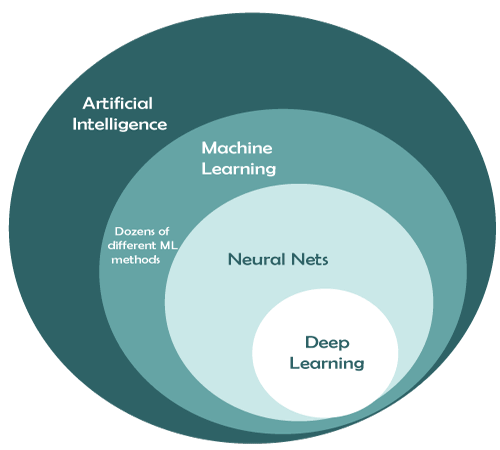

# Neuro Komputing
> ### Catatan pembelajaran kecerdasan buatan (AI) Politeknik Elektronika Negeri Surabaya (PENS) semester 8

## Pertemuan ke-2
Berikut adalah tabel kebenaran dan penjelasan singkat untuk masing-masing dari 8 gerbang logika:

### 1. NOT Gate (Gerbang NOT)

| A | NOT A |
|---|-------|
| 0 |   1   |
| 1 |   0   |

**Penjelasan**: NOT Gate menghasilkan output yang merupakan kebalikan dari inputnya. Jika input adalah 0, maka output adalah 1, dan sebaliknya.

### 2. AND Gate (Gerbang AND)

| A | B | A AND B |
|---|---|---------|
| 0 | 0 |    0    |
| 0 | 1 |    0    |
| 1 | 0 |    0    |
| 1 | 1 |    1    |

**Penjelasan**: AND Gate menghasilkan keluaran hanya jika kedua inputnya adalah 1. Jika salah satu atau kedua input adalah 0, maka keluaran adalah 0.

### 3. OR Gate (Gerbang OR)

| A | B | A OR B |
|---|---|--------|
| 0 | 0 |   0    |
| 0 | 1 |   1    |
| 1 | 0 |   1    |
| 1 | 1 |   1    |

**Penjelasan**: OR Gate menghasilkan keluaran jika minimal satu atau kedua inputnya adalah 1. Hanya jika kedua input adalah 0, maka keluaran akan menjadi 0.

### 4. NAND Gate (Gerbang NAND)

| A | B | NAND A, B |
|---|---|-----------|
| 0 | 0 |    1      |
| 0 | 1 |    1      |
| 1 | 0 |    1      |
| 1 | 1 |    0      |

**Penjelasan**: NAND Gate adalah kebalikan dari AND Gate. Ia menghasilkan keluaran 0 jika kedua inputnya adalah 1, dan 1 untuk semua kondisi lainnya.

### 5. NOR Gate (Gerbang NOR)

| A | B | NOR A, B |
|---|---|----------|
| 0 | 0 |    1     |
| 0 | 1 |    0     |
| 1 | 0 |    0     |
| 1 | 1 |    0     |

**Penjelasan**: NOR Gate adalah kebalikan dari OR Gate. Ia menghasilkan keluaran 1 jika kedua inputnya adalah 0, dan 0 untuk semua kondisi lainnya.

### 6. XOR Gate (Gerbang XOR)

| A | B | XOR A, B |
|---|---|----------|
| 0 | 0 |    0     |
| 0 | 1 |    1     |
| 1 | 0 |    1     |
| 1 | 1 |    0     |

**Penjelasan**: XOR Gate menghasilkan keluaran 1 jika jumlah input yang bernilai 1 ganjil (1, 3, 5, ...), dan keluaran 0 jika jumlah input yang bernilai 1 genap (0, 2, 4, ...).

### 7. XNOR Gate (Gerbang XNOR)

| A | B | XNOR A, B |
|---|---|-----------|
| 0 | 0 |     1     |
| 0 | 1 |     0     |
| 1 | 0 |     0     |
| 1 | 1 |     1     |

**Penjelasan**: XNOR Gate adalah kebalikan dari XOR Gate. Ia menghasilkan keluaran 1 jika jumlah input yang bernilai 1 genap, dan keluaran 0 jika jumlah input yang bernilai 1 ganjil.

### 8. AND-NOT Gate (Gerbang AND-NOT)

| A | B | NOT B | A AND (NOT B) |
|---|---|-------|--------------|
| 0 | 0 |   1   |      0       |
| 0 | 1 |   0   |      0       |
| 1 | 0 |   1   |      1       |
| 1 | 1 |   0   |      0       |

**Penjelasan**: AND-NOT Gate menghasilkan keluaran 1 hanya jika input pertama adalah 1 dan input kedua adalah 0.

Jaringan Saraf Tiruan (JST) adalah model matematika yang terinspirasi dari struktur dan fungsi jaringan saraf biologis dalam otak manusia. Tujuan utama JST adalah untuk dapat memodelkan dan memahami pola kompleks dalam data dengan cara yang mirip dengan bagaimana otak manusia mengenali pola-pola tersebut.

Berikut ini adalah beberapa konsep dasar tentang Jaringan Saraf Tiruan (JST):

1. **Neuron**: Neuron adalah unit dasar dalam JST yang menerima input, melakukan operasi matematika pada input tersebut, dan menghasilkan output. Neuron dalam JST mirip dengan neuron dalam otak manusia, memiliki bobot yang dapat diatur untuk memodifikasi pengaruh dari setiap input.

2. **Lapisan**: JST terdiri dari lapisan-lapisan neuron yang terhubung. Ada tiga jenis lapisan utama dalam JST:

   - **Lapisan Masukan (Input Layer)**: Menerima data input yang akan diproses oleh JST. Setiap neuron dalam lapisan ini mewakili fitur atau atribut dari data input.
   
   - **Lapisan Tersembunyi (Hidden Layer)**: Lapisan-lapisan ini berada di antara lapisan masukan dan lapisan output. Setiap neuron dalam lapisan ini mengambil input dari lapisan sebelumnya, melakukan operasi matematika, dan mengirimkan hasilnya ke neuron-neuron pada lapisan berikutnya.
   
   - **Lapisan Keluaran (Output Layer)**: Lapisan ini menghasilkan output akhir dari JST. Jumlah neuron dalam lapisan ini tergantung pada jenis masalah yang dihadapi, misalnya, klasifikasi atau regresi.

3. **Bobot**: Setiap koneksi antara neuron memiliki bobot yang mempengaruhi sejauh mana input yang diteruskan oleh koneksi tersebut. Selama proses pelatihan, bobot-bobot ini diubah secara berulang-ulang untuk meminimalkan kesalahan prediksi JST.

4. **Fungsi Aktivasi**: Neuron biasanya memiliki fungsi aktivasi yang digunakan untuk mengintroduksi non-linearitas ke dalam JST. Fungsi aktivasi ini menentukan apakah neuron akan "menyala" (mengirimkan output) berdasarkan pada input dan bobot yang diterimanya.

5. **Pelatihan**: Proses pelatihan JST melibatkan memberikan data input ke dalam jaringan dan menghitung output yang dihasilkan. Selisih antara output yang dihasilkan dan output yang diharapkan (ground truth) menghasilkan kesalahan. Metode seperti Backpropagation digunakan untuk menghitung seberapa besar setiap bobot perlu diubah untuk mengurangi kesalahan ini. Tujuannya adalah untuk mengoptimalkan kinerja JST pada data yang belum pernah dilihat sebelumnya.

6. **Arsitektur**: Arsitektur JST merujuk pada jumlah lapisan dan jumlah neuron dalam setiap lapisan. Arsitektur yang tepat sangat tergantung pada jenis masalah yang dihadapi.

JST dapat digunakan untuk berbagai macam masalah seperti klasifikasi, regresi, pengenalan pola, dan lain-lain. Seiring berjalannya waktu, JST telah berkembang menjadi model yang lebih kompleks seperti Jaringan Saraf Dalam (Deep Neural Networks) yang memiliki banyak lapisan tersembunyi untuk menangani masalah yang semakin rumit.

### Latihan 1
Tentu, berikut adalah contoh sederhana tentang bagaimana Jaringan Saraf Tiruan (JST) dengan 1 lapisan dapat digunakan untuk menyelesaikan masalah klasifikasi sederhana. Mari kita anggap Anda memiliki dataset sederhana tentang dua jenis bunga dengan dua fitur numerik (panjang kelopak dan panjang mahkota) dan Anda ingin membangun JST untuk memprediksi jenis bunga berdasarkan fitur-fitur ini.

**Masalah:**
Klasifikasi bunga dengan dua fitur numerik (panjang kelopak dan panjang mahkota), dengan label kelas (0: Bunga A, 1: Bunga B).

**Struktur JST:**
- Lapisan Masukan: 2 neuron (sesuai jumlah fitur)
- Lapisan Tersembunyi: 2 neuron, fungsi aktivasi ReLU
- Lapisan Keluaran: 1 neuron, fungsi aktivasi sigmoid

**Parameter Bobot:**
- Bobot Lapisan Tersembunyi: w1, w2, w3, w4
- Bobot Lapisan Keluaran: w5, w6

**Forward Propagation:**
Misalkan fitur input baru adalah x1 = 2.8 dan x2 = 1.3.

1. Hitung nilai input untuk setiap neuron di lapisan tersembunyi:
   - Z1 = w1 * x1 + w2 * x2
   - Z2 = w3 * x1 + w4 * x2

2. Terapkan fungsi aktivasi ReLU pada setiap nilai input di lapisan tersembunyi:
   - A1 = max(0, Z1)
   - A2 = max(0, Z2)

3. Hitung nilai input untuk neuron di lapisan keluaran:
   - Z3 = w5 * A1 + w6 * A2

4. Terapkan fungsi aktivasi sigmoid pada nilai input di lapisan keluaran:
   - Output = 1 / (1 + exp(-Z3))

**Prediksi:**
Jika nilai Output > 0.5, maka prediksi kelas adalah 1 (Bunga B), jika tidak, prediksi kelas adalah 0 (Bunga A).

Harap diingat bahwa contoh ini hanya menunjukkan perhitungan dasar dari lapisan-lapisan dalam JST. Dalam praktiknya, proses pelatihan melibatkan optimisasi bobot melalui metode seperti Backpropagation untuk meminimalkan kesalahan prediksi pada data pelatihan.

### Latihan 2
Tentu, mari kita lihat contoh lain dari perhitungan Jaringan Saraf Tiruan (JST) dengan 1 lapisan tersembunyi, kali ini dalam konteks masalah regresi sederhana. Misalkan kita memiliki dataset sederhana yang terdiri dari dua fitur input dan satu target output numerik.

**Masalah:**
Prediksi nilai output berdasarkan dua fitur input: x1 dan x2.

**Struktur JST:**
- Lapisan Masukan: 2 neuron (sesuai jumlah fitur)
- Lapisan Tersembunyi: 3 neuron, fungsi aktivasi ReLU
- Lapisan Keluaran: 1 neuron (output regresi)

**Parameter Bobot:**
- Bobot Lapisan Tersembunyi: w1, w2, w3, w4, w5, w6
- Bobot Lapisan Keluaran: w7, w8, w9

**Forward Propagation:**
Misalkan fitur input baru adalah x1 = 0.6 dan x2 = 0.8.

1. Hitung nilai input untuk setiap neuron di lapisan tersembunyi:
   - Z1 = w1 * x1 + w2 * x2
   - Z2 = w3 * x1 + w4 * x2
   - Z3 = w5 * x1 + w6 * x2

2. Terapkan fungsi aktivasi ReLU pada setiap nilai input di lapisan tersembunyi:
   - A1 = max(0, Z1)
   - A2 = max(0, Z2)
   - A3 = max(0, Z3)
> #### **Fungsi max()**: Fungsi `max(a, b)` adalah fungsi dalam matematika yang mengambil dua bilangan `a` dan `b`, dan mengembalikan nilai terbesar di antara keduanya. Dalam konteks perhitungan dalam lapisan tersembunyi dari Jaringan Saraf Tiruan (JST), fungsi `max(0, Z)` digunakan untuk mengimplementasikan aktivasi ReLU.

> #### **Aktivasi ReLU (Rectified Linear Activation)**: Aktivasi ReLU adalah jenis fungsi aktivasi yang umum digunakan dalam jaringan saraf tiruan. Fungsi aktivasi ReLU didefinisikan sebagai berikut: 
> #### `f(x) = max(0, x)`
> #### A. Jika input (biasanya hasil penjumlahan bobot dan input) positif atau nol, maka outputnya adalah nilai input itu sendiri. 
> ##### - Jika `x = 2`, maka `f(x) = max(0, 2) = 2`
> #### B. Jika input negatif, maka outputnya adalah nol. 
> ##### - Jika `x = -1`, maka `f(x) = max(0, -1) = 0`
> #### Fungsi ini diwakili oleh rumus matematika: `f(x) = max(0, x)`, di mana `x` adalah input. Aktivasi ReLU efektif dalam memecahkan masalah vanishing gradient yang sering ditemukan dalam fungsi aktivasi lainnya seperti sigmoid dan tangen hiperbolik.

3. Hitung nilai input untuk neuron di lapisan keluaran:
    - Z4 = w7 * A1 + w8 * A2 + w9 * A3

4. Output dari JST adalah nilai Z4, yang merupakan prediksi regresi.

**Catatan:**
Dalam masalah regresi, tidak ada fungsi aktivasi khusus pada lapisan keluaran karena kita ingin prediksi yang dapat mengambil nilai kontinu. Output dari JST adalah hasil perhitungan pada lapisan keluaran.

## Node 2
## Node 3

## Random
- activacion function
- sigmoin
- hyperbolic tangent
- rectified liniead units
- leaky relu
- swish

- Long short-term memory (LSTM)
- natural language processing (NLP)
- Recurrent neural network (RNN)

