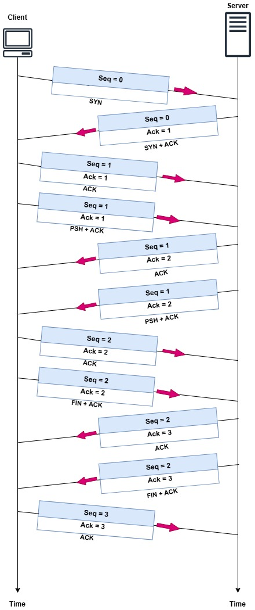

# Analisis Komunikasi TCP dengan Pemrograman Socket dan Wireshark
---
Tujuan dari tugas ini adalah untuk mempelajari bagaimana socket programming dan Wireshark melakukan komunikasi TCP antara client dan server. Proses ini mencakup pengiriman data sederhana dan analisis paket TCP untuk memahami alur komunikasi. Ini mencakup pembentukan koneksi dengan tangan tiga arah, pengiriman data, dan penutupan koneksi dengan tangan tiga arah.

---
## Deskripsi
saya melakukan komunikasi client-server dengan menggunakan socket programming sederhana yang tersedia di [Github ferryastika](https://github.com/ferryastika/socket-programming-simple-server-and-client). Server dijalankan pada port 8000, dan client terhubung ke server. Data yang dikirim dengan karakter A dianalisis menggunakan Wireshark.  
Hasil analisis Wireshark ditunjukkan dalam diagram Sequence TCP, yang menunjukkan detail komunikasi TCP secara berurutan mulai dari pembentukan koneksi hingga penutup koneksi.

---
## TCP Sequence Diagram
**TCP Sequence Diagram** adalah representasi visual dari bagaimana protokol Transmission Control Protocol (TCP) beroperasi selama komunikasi antara dua perangkat di jaringan. Diagram ini menggambarkan proses pengiriman dan penerimaan paket TCP, termasuk detail seperti pengaturan koneksi (handshake), transfer data, dan terminasi koneksi.

---
## TCP Connection Establishment (Three-Way Handshake)

**Establishment of Connection**

### Step 1: SYN (Synchronize)
- **Client**: Mengirimkan paket **SYN** ke Server untuk memulai koneksi.
  - Paket: `SYN`, Seq = 0

### Step 2: SYN-ACK (Synchronize-Acknowledgment)
- **Server**: Menanggapi dengan paket **SYN-ACK** untuk mengonfirmasi permintaan.
  - Paket: `SYN+ACK`, Seq = 0, Ack = 1

### Step 3: ACK (Acknowledgment)
- **Client**: Mengirimkan paket **ACK** untuk mengonfirmasi bahwa koneksi berhasil dibuat.
  - Paket: `ACK`, Seq = 1, Ack = 1

### **Data Exchange**

### Step 4: Client Sends Data
- **Client**: Mengirim data ke server.
  - Paket: `PSH+ACK`, Seq = 1, Ack = 1

### Step 5: Server Acknowledges Data
- **Server**: Mengirim **ACK** untuk mengonfirmasi penerimaan data dari Client.
  - Paket: `ACK`, Seq = 1, Ack = 2

### Step 6: Server Sends Data
- **Server**: Mengirim data kembali ke Client.
  - Paket: `PSH+ACK`, Seq = 1, Ack = 2

### Step 7: Client Acknowledges Data
- **Client**: Mengirim **ACK** untuk mengonfirmasi penerimaan data dari Server.
  - Paket: `ACK`, Seq = 2, Ack = 2

### **Connection Termination**

### Step 8: Client Initiates Termination
- **Client**: Mengirimkan paket **FIN+ACK** untuk mengakhiri koneksi.
  - Paket: `FIN+ACK`, Seq = 2, Ack = 2

### Step 9: Server Acknowledges FIN
- **Server**: Mengirimkan **ACK** untuk memverifikasi permintaan terminasi dari Client.
  - Paket: `ACK`, Seq = 2, Ack = 3

### Step 10: Server Sends FIN
- **Server**: Mengirimkan **FIN+ACK** untuk mengakhiri koneksi dari sisi server.
  - Paket: `FIN+ACK`, Seq = 2, Ack = 3

### Step 11: Client Acknowledges FIN
- **Client**: Mengirimkan paket **ACK** terakhir untuk mengonfirmasi bahwa koneksi telah tertutup.
  - Paket: `ACK`, Seq = 3, Ack = 3

## **Connection Closed**
Pada tahap ini, koneksi TCP telah berhasil ditutup.

---
## Informasi Tambahan
- **Seq (Sequence Number):** Nomor urut yang digunakan untuk melacak byte data yang dikirimkan.
- **Ack (Acknowledgment Number):** Nomor untuk mengonfirmasi byte data yang telah diterima.
- **PSH (PUSH) :** Memberitahu penerima untuk segera memproses data.
- **FIN (Final) :** Digunakan untuk mengakhiri koneksi.

