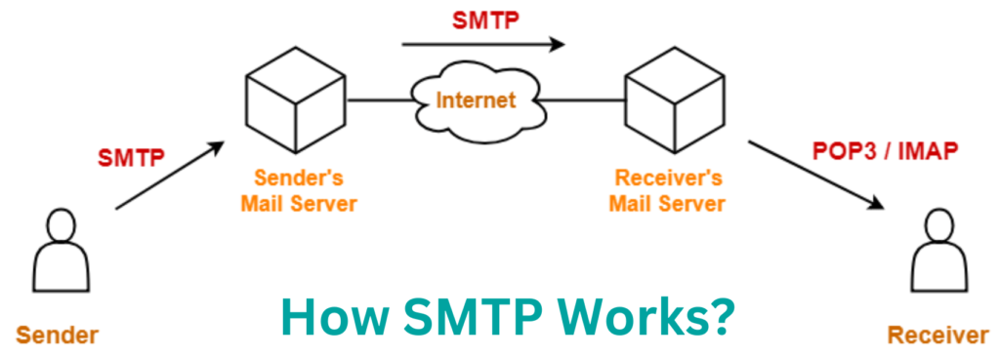

# SMTP (Simple Mail Transfer Protocol)
SMTP (Simple Mail Transfer Protocol) adalah protokol yang digunakan untuk mengirimkan email melalui internet. Protokol ini memungkinkan pengiriman pesan dari klien email (pengirim) ke server email penerima. Berikut adalah langkah-langkah cara kerja SMTP:

---

### 1. **Pengguna Menulis Email**

- Pengguna mengetik email menggunakan klien email, seperti Outlook, Gmail, atau Thunderbird.
- Email ini berisi:
    - Alamat pengirim (contoh: **[pengirim@example.com](mailto:pengirim@example.com)**).
    - Alamat penerima (contoh: **[penerima@example.com](mailto:penerima@example.com)**).
    - Subjek dan isi pesan.

---

### 2. **Koneksi ke SMTP Server**

- Ketika pengguna menekan tombol "Kirim," klien email terhubung ke server SMTP pengirim, misalnya **smtp.example.com**.
- Klien email berkomunikasi dengan server SMTP melalui port yang umum digunakan:
    - **Port 25**: Port default (kadang diblokir untuk mencegah spam).
    - **Port 465**: Untuk koneksi SSL.
    - **Port 587**: Untuk koneksi TLS (lebih umum digunakan saat ini).

---

### 3. **Autentikasi Pengirim**

- Pengirim harus memberikan kredensial (username dan password) ke server SMTP.
- Server memverifikasi bahwa pengirim memiliki hak untuk mengirimkan email.

---

### 4. **Pengiriman Email ke SMTP Server**

- Setelah terautentikasi, klien email mengirimkan:
    - **Header**: Informasi tentang pengirim, penerima, waktu, dan subjek.
    - **Body**: Isi email, termasuk teks dan lampiran.

---

### 5. **Proses SMTP Server Pengirim**

- Server SMTP pengirim memeriksa alamat penerima:
    - **Domain yang Sama**: Jika alamat penerima berada di domain yang sama, server langsung mengirimkan email ke mailbox penerima.
    - **Domain yang Berbeda**: Jika domain berbeda (misalnya, dari **[pengirim@example.com](mailto:pengirim@example.com)** ke **[penerima@gmail.com](mailto:penerima@gmail.com)**), server SMTP pengirim mencari server penerima.

---

### 6. **Query DNS untuk Server Penerima**

- SMTP server melakukan pencarian DNS untuk menemukan **MX Record (Mail Exchange Record)** dari domain penerima (misalnya, **gmail.com**).
- MX Record memberikan alamat server penerima yang bertanggung jawab atas pengiriman email untuk domain tersebut.

---

### 7. **Transfer ke SMTP Server Penerima**

- Server SMTP pengirim mengirimkan email ke server SMTP penerima yang ditemukan melalui MX Record.

---

### 8. **SMTP Server Penerima Memproses Email**

- SMTP server penerima memeriksa apakah alamat email penerima valid.
    - Jika valid, email disimpan di mailbox penerima.
    - Jika tidak valid, email dikembalikan ke pengirim dengan pesan error.

---

### 9. **Penerima Mendapatkan Email**

- Penerima menggunakan protokol lain, seperti **IMAP (Internet Message Access Protocol)** atau **POP3 (Post Office Protocol)**, untuk mengunduh email dari server penerima ke klien email mereka.

---

### Ilustrasi Proses SMTP

1. Anda (pengirim) mengirim email dari **[pengirim@example.com](mailto:pengirim@example.com)** ke **[penerima@gmail.com](mailto:penerima@gmail.com)**.
2. Klien email Anda menghubungi SMTP server pengirim (**smtp.example.com**).
3. SMTP server pengirim mencari MX Record untuk **gmail.com**.
4. SMTP server pengirim mengirim email ke SMTP server Gmail.
5. Gmail memeriksa dan menyimpan email di mailbox penerima.
6. Penerima membuka email melalui klien email mereka, menggunakan IMAP atau POP3.

---

### Keuntungan SMTP

- **Standar Industri**: Digunakan oleh semua penyedia email.
- **Efisiensi**: Mengelola pengiriman email dalam jaringan yang besar.
- **Keandalan**: Memberikan notifikasi jika email gagal dikirim.

SMTP adalah tulang punggung sistem pengiriman email di seluruh dunia, memastikan pesan Anda sampai ke tujuan dengan aman dan efisien.

# IMAP vs **POP3**
Perbedaan utama antara **IMAP** dan **POP3** adalah cara keduanya mengelola email yang diunduh dari server:

---

### **1. IMAP (Internet Message Access Protocol)**

- **Sinkronisasi Dua Arah**: Email tetap tersimpan di server dan disinkronkan dengan perangkat Anda. Perubahan pada satu perangkat (misalnya, membaca, menghapus, atau memindahkan email) akan tercermin di perangkat lain.
- **Akses Multi-Perangkat**: Ideal jika Anda menggunakan beberapa perangkat (laptop, ponsel, tablet) untuk mengakses email.
- **Menghemat Ruang Lokal**: Email tetap tersimpan di server, sehingga tidak memakan banyak ruang di perangkat Anda, kecuali Anda memilih untuk menyimpannya secara offline.
- **Memerlukan Koneksi Internet Aktif**: Untuk membaca email yang belum diunduh, Anda memerlukan koneksi internet.

---

### **2. POP3 (Post Office Protocol, versi 3)**

- **Unduh dan Hapus dari Server**: Email diunduh ke perangkat lokal, lalu biasanya dihapus dari server (meskipun beberapa klien menawarkan opsi untuk menyimpan salinan di server).
- **Akses Terbatas ke Perangkat Lokal**: Email yang diunduh hanya tersedia di perangkat tempat Anda mengaksesnya pertama kali.
- **Tidak Ada Sinkronisasi**: Perubahan yang Anda lakukan di satu perangkat (seperti membaca atau menghapus) tidak tercermin di perangkat lain.
- **Menghemat Ruang Server**: Karena email dihapus dari server, cocok untuk server dengan ruang terbatas.

---

### **Kapan Menggunakan IMAP?**

- Jika Anda membutuhkan akses email dari beberapa perangkat.
- Jika Anda ingin email tetap tersimpan di server untuk cadangan.

### **Kapan Menggunakan POP3?**

- Jika Anda hanya menggunakan satu perangkat untuk email.
- Jika Anda ingin mengunduh email untuk akses offline dan menghemat ruang di server.

IMAP lebih umum digunakan saat ini karena fleksibilitas dan kemudahan sinkronisasi antar perangkat.

# Ringkasan
-  **SMTP**: Protokol dari **klien ke server** (untuk pengiriman) dan dari **server ke server** (untuk pengiriman antar domain).
- **IMAP dan POP3**: Protokol dari **server ke klien**, digunakan untuk membaca/mengunduh email.