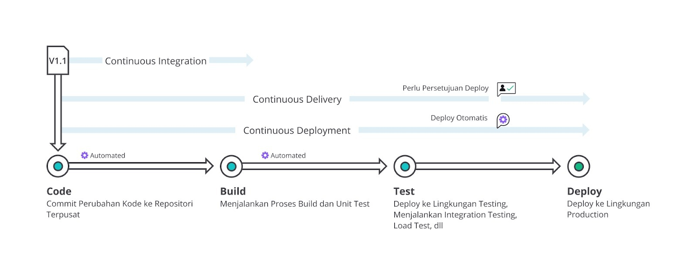
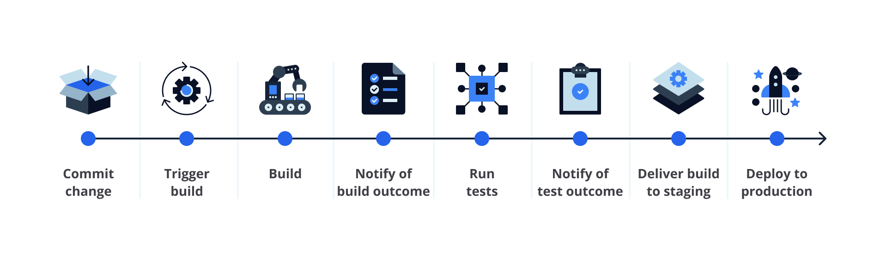
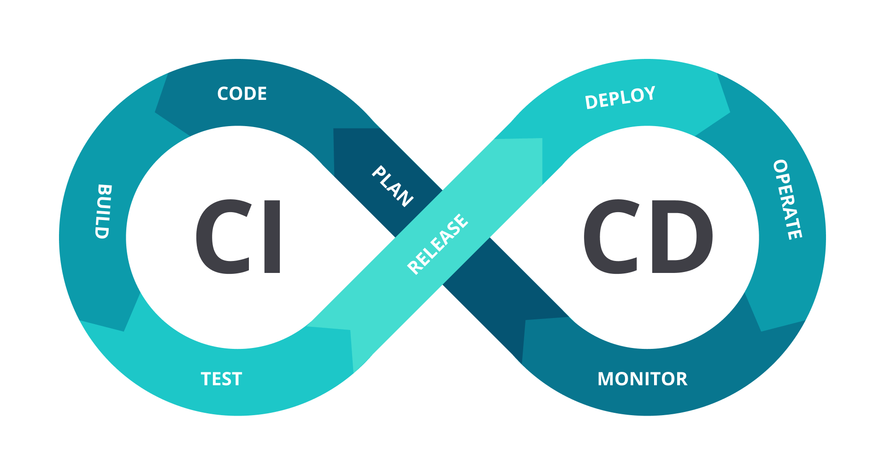
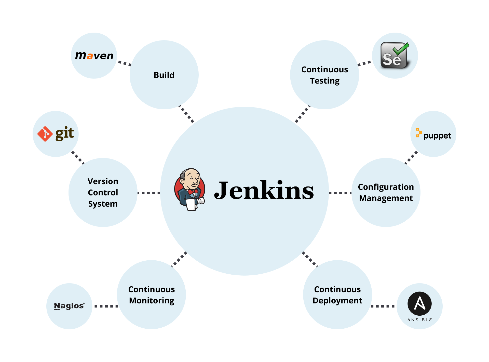
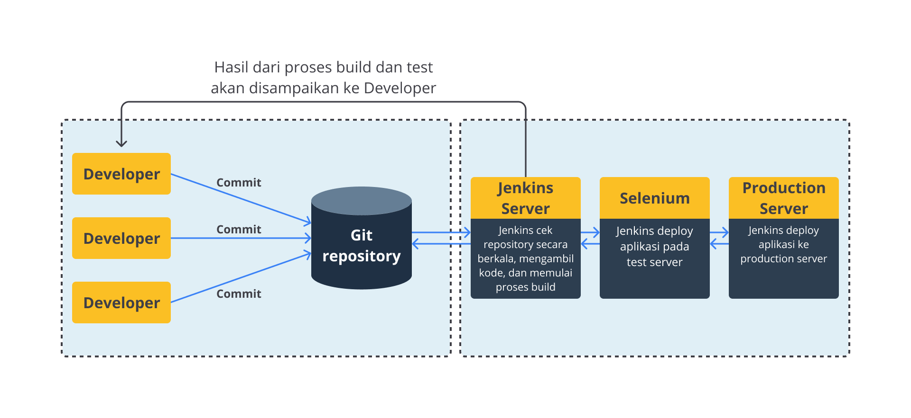

# vv

## Continuous Integration (CI)

Continuous integration (biasa disingkat CI) merupakan praktik pengembangan aplikasi/perangkat lunak di mana Developer secara teratur (atau sesering mungkin) mengunggah (push) atau menggabungkan (merge) perubahan kode (code changes) mereka ke sebuah repositori terpusat (central repository) dan/atau ke mainline trunk (seperti branch master/main), setelah itu proses pembentukan (build) dan pengujian (test) secara otomatis akan dijalankan.

## Continuous Delivery/Deployment (CD)

Gambar di atas menunjukkan alur perbedaan antara continuous integration, continuous delivery, dan continuous deployment.

## CI/CD Pipeline

## Alur CI/CD

Plan→Code→Build→Test→Release→Deploy→Operate→Monitor
Berikut beberapa contoh praktik pengujian yang umumnya dilakukan.

* **Functional testing**: Memvalidasi sistem aplikasi dengan kebutuhan fungsional.
* **Integration testing**: Setiap unit atau komponen aplikasi digabungkan dan diuji sebagai sebuah grup/kelompok.
* **Regression testing**: Menjalankan kembali functional dan non-functional test untuk memastikan bahwa aplikasi yang telah dikembangkan dan diuji sebelumnya masih berfungsi setelah terjadi perubahan kode.
* **Acceptance testing**: Pengujian dilakukan oleh klien, pengguna, atau entitas resmi lainnya guna menentukan apakah kebutuhan aplikasi dan proses bisnis sudah terpenuhi atau belum.
* **Load testing**: Pengujian kinerja aplikasi yang menyimulasikan beban kerja atau traffic pada dunia nyata.
* **Security testing**: Mengidentifikasi kerentanan, kelemahan, ancaman, dan risiko keamanan pada aplikasi guna mencegah serangan berbahaya dari penyusup.

# Pengenalan Git

## Repository

Repository adalah istilah yang digunakan sebagai penyimpanan source code

## Clone

Clone (cloning) adalah proses menyalin atau mengkloning repositori dari remote repository (misal, GitHub repository) ke local repository (komputer pribadi)

## Branch

Setiap git repository memiliki minimal satu branch, yakni main branch (cabang utama)

## Commit

Commit merupakan sebuah aksi yang dilakukan Developer untuk membuat rekam jejak (snapshot) terhadap perubahan kode yang ia tulis.

- `git add`
- `git commit`

## Push

Push merupakan aksi untuk mengirim perubahan kode dari local repository ke remote repository.

## Pull Request

Pull Request adalah sebuah pengajuan/permintaan (request) untuk menggabungkan perubahan kode pada suatu branch ke branch lain.

## Merge

Merge merupakan aksi untuk menggabungkan perubahan kode pada suatu branch ke branch lain. Merge dapat dilakukan melalui atau tanpa pull request. Saat kita melakukan merge, Anda akan dihadapkan dengan beberapa opsi metode merge, seperti:

- fast-forward merge
- 3-way merge
- squash and merge

## Jenkins

Jenkins adalah tools otomatisasi open source yang dapat digunakan untuk mengotomatisasi semua jenis pekerjaan terkait building, testing, dan delivering/deploying perangkat lunak. Jenkins bisa dipergunakan untuk memadukan berbagai tahapan DevOps (alur CI/CD) dengan bantuan Plugin. Apabila ingin mengintegrasikan tools tertentu, Anda perlu menginstal plugin untuk tools tersebut di Jenkins. Misalnya, 

- git untuk version control system, 
- Maven untuk proses build, 
- Selenium untuk continuous testing, 
- Puppet untuk configuration management, 
- Ansible untuk continuous deployment, 
- Nagios untuk continuous monitoring, 
- dan lain sebagainya.

