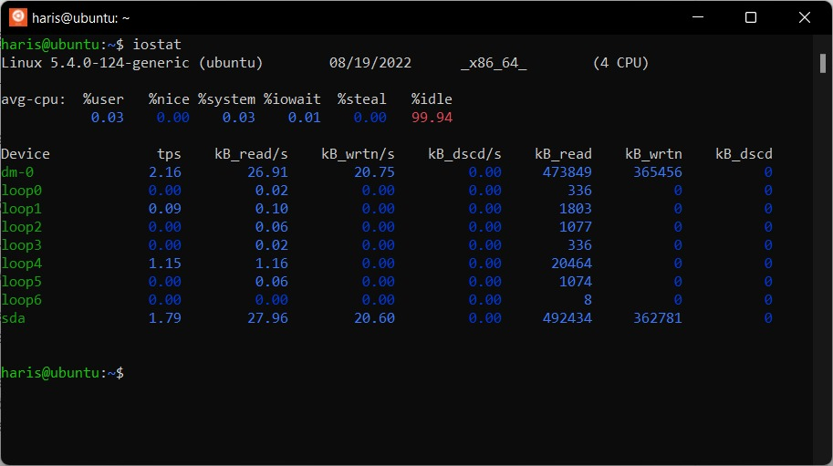
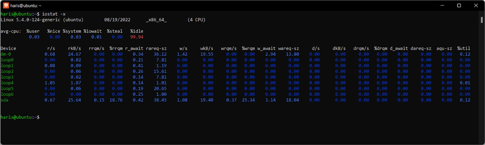
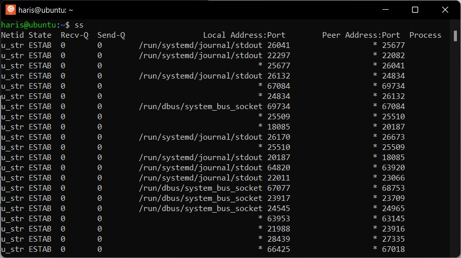
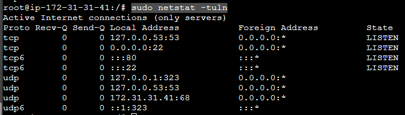
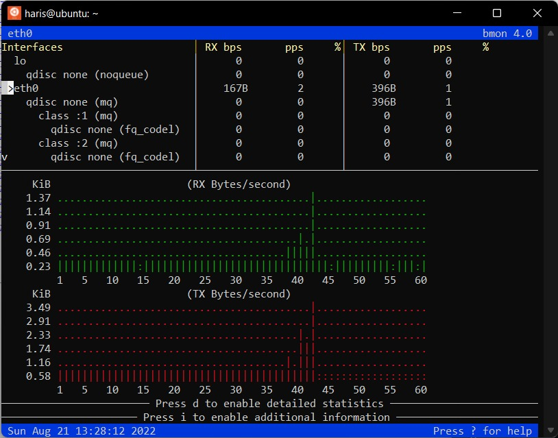

# Menjadi Linux System Administrator - Dicoding Academy AWS

## Glosarium
- **Booting**, Dalam dunia komputer, booting adalah proses memulai komputer melalui tombol fisik atau dengan baris perintah/tombol antarmuka pengguna. 
- **Daemon**, Dalam ekosistem Unix dan Linux, daemon adalah program yang berjalan di latar belakang tanpa memerlukan interaksi pengguna.
- **Kernel**, Komponen utama dari sistem operasi yang bertugas untuk mengelola operasional komputer dan perangkat keras.
- **Package manager**, Kumpulan tools perangkat lunak yang mengotomatiskan proses menginstal, meningkatkan, mengkonfigurasi, dan menghapus program komputer secara konsisten.

Beberapa distro yang sudah berumur dan terkenal adalah Debian, Slackware, dan Red Hat. Distro-distro ini memiliki distro turunan atau bisa disebut hasil modifikasi.
- Debian memiliki turunan bernama Ubuntu dan menjadi lebih terkenal dari pada distro induknya. Bahkan, di Indonesia juga terdapat distro BlankOn yang merupakan turunan Debian. 
- Slackware menurunkan SUSE/openSUSE.
- Sementara itu, turunan Red Hat adalah CentOS dan Fedora. 

package manager (pengelola paket)
- **apt**, Debian, Ubuntu, beserta turunannya.
- **zyppe**, Slackware memiliki pkgtools dan SUSE/openSUSE.
- **yum**, Red Hat, Fedora, CentOS, serta turunannya.

- **bash** dan **zsh** adalah shell yang digunakan pada linux.

Kernel memiliki 4 tugas penting.

- **Memory management**: Melacak berapa banyak memori yang digunakan saat menjalankan pekerjaan.
- **Process management**: Menentukan proses mana yang dapat menggunakan CPU, kapan, dan untuk berapa lama.
- **Device drivers**: Bertindak sebagai mediator/penerjemah antara perangkat keras dan proses pada sistem operasi.
- **System calls and security**: Menerima permintaan dari berbagai proses pada sistem operasi.


|   Command |   Keterangan                                                                                                              |
|-----------|---------------------------------------------------------------------------------------------------------------------------|
|**su**     | Berganti user. Perintah ini diambil dari kata bahasa Inggris: switch user.                                                |  
|**sudo**   | (Super User Do, Switch User and the Do). Menjalankan perintah sebagai super user atau user lainnya.                       |
|**cp**     | Menyalin berkas atau direktori. Perintah ini diambil dari kata bahasa Inggris: copy.                                      |
|**mv**     | Mengganti nama; atau memindahkan posisi berkas atau direktori. Perintah ini diambil dari kata bahasa Inggris: move.       |
|**rm**     | Menghapus berkas atau direktori. Perintah ini diambil dari kata bahasa Inggris: remove.                                   |
|**mkdir**  | Membuat direktori baru. Perintah ini diambil dari frase bahasa Inggris: make directory.                                   |
|**rmdir**  | Menghapus direktori yang kosong. Perintah ini diambil dari frase bahasa Inggris: remove directory.                        |
|**cat**    | Melihat ataupun menggabungkan isi berkas. Perintah ini diambil dari kata bahasa Inggris: concatenate.                     |
|**less**   | Melihat isi berkas per halaman teks.                                                                                      |
|**touch**  | Mengubah waktu akses terakhir sebuah berkas (timestamp). Apabila berkas belum ada, perintah ini akan membuat berkas baru. |
|**who**    | Melihat siapa saja yang sedang login di komputer.|
|**echo**   | Menampilkan perintah atau teks yang diketikkan.|
|**free**   | Menampilkan penggunaan dari memori nyata (RAM) dan memori virtual (SWAP).|
|**top**    | Melihat semua program yang sedang berjalan, termasuk pemakaian prosesor dan RAM.|
|**ps ux**  |, Melihat daftar semua program yang sedang berjalan/digunakan beserta nomor prosesnya (PID). |
|**du**     | Melihat besarnya ukuran direktori yang telah digunakan.|
|**df**     | Melihat besar ukuran partisi disk dan ruang yang tersisa.|
|**date**   | Menampilkan tanggal dan jam.|
|**exit**   | Keluar (logout) dari user yang sedang digunakan. Bisa juga dengan menekan Ctrl + D.|
|**--help** | Ini adalah opsi yang umum dalam menampilkan bantuan dari sebuah perintah. Ditulis di akhir perintah dengan jeda satu spasi. Contohnya: ls --help|
|**man**    | Menampilkan manual dari sebuah perintah. Cara penggunaannya dengan mengetikkan nama perintah yang dicari tahu setelah perintah man.|
|**pwd**    | (Print Working Directory). Perintah ini akan menampilkan path lengkap direktori kerja Anda saat ini
|**ls -l**  | akan menampilkan informasi berkas atau direktori beserta kepemilikannya
|**ps -aux**| akan menampilkan proses yang sedang dijalankan oleh sistem beserta informasi user yang menjalankannya.

## Root User, Regular User, dan System User
- **Root User**: memiliki home directory spesial di `/root/`, 
- **Regular User**: memiliki home directory di `/home/namauser/`, regular user memiliki User ID (UID) 1000 sampai 65533 dan 65536 sampai 4294967294. Shell dari regular user ditandai dengan prompt "$".
- **System User**: system user memiliki UID 1 sampai 999, tak bisa digunakan oleh pengguna biasa
```
root@Asus416EA:/home/namax# id
uid=0(root) gid=0(root) groups=0(root)
```
```
nano /etc/passwd
```
> <sup>1</sup>ruby:<sup>2</sup>x:<sup>3</sup>1001:<sup>4</sup>1001:<sup>5</sup>G. Ruby,04,89858451,-:<sup>6</sup>/home/ruby:<sup>7</sup>/bin/bash

1. Username. Dalam hal ini adalah "ruby".
2. Password dari user yang awalnya disimpan di sini dalam bentuk sudah terenkripsi. Karena alasan keamanan (file `/etc/passwd` bisa dilihat oleh semua user), maka password dipindah ke dalam file `/etc/shadow` yang akan dibahas di poin berikutnya. Oleh karenanya, bagian ini harus selalu terisi dengan karakter "x".
3. User ID (UID). Dalam hal ini adalah "1001".
4. Group ID (GID) dari grup utama (primary group) yang dimiliki oleh user ini. Lebih lengkap mengenai group ada pada file `/etc/group`. Bagian ini diisi dengan "1001".
5. User ID Info. Bisa berisi nama lengkap, nomor ruangan, nomor handphone, dan sebagainya. Bagian ini diisi dengan: "G. Ruby (nama lengkap), 04 (nomor ruangan), 89858451 (nomor HP untuk kerja), - (nomor rumah, diisi '-')".
6. Home directory dari user. Ini adalah direktori awal ketika shell dimulai dan berisi data (berkas-berkas yang dimiliki oleh user), pengaturan, atau konfigurasi dari user tersebut. Bagian ini diisi dengan "/home/ruby".
7. Shell yang dijadikan default untuk user ini. Dalam hal ini adalah bash dengan lokasi `/bin/bash`. Untuk tipe system user, umumnya menggunakan `/sbin/nologin` apabila tidak membutuhkan login secara interaktif sehingga kita tidak bisa masuk atau log in ke user tersebut.

----
1. Membuat User Baru
    - `adduser`, Perintah ini secara default akan meminta informasi tambahan berupa New password, Full Name, Room Number, Work Phone, Home Phone, dan Other. Perintah ini juga menghasilkan direktori home untuk user yang dibuat.
        ```
        sudo adduser user01
        ```
    - `useradd`, Secara default, perintah ini tidak meminta informasi tambahan dan tidak menghasilkan direktori home untuk user yang dibuat
        ```
        sudo useradd user02
        ```
    - `man useradd`, Jika ingin menambahkan informasi yang lebih lengkap, menambahkan opsi agar menghasilkan home directory.
2. Menghapus User
    ```
    sudo userdel user01
    ```
- sekalian menghapus home directory dari user tersebut
    ```
    sudo userdel -r user01
    ```
3. Group

    Group adalah kumpulan user yang membutuhkan akses bersama ke beberapa file atau sumber daya sistem.
    ```
    nano /etc/group
    ```
    > <sup>1</sup>adm:<sup>2</sup>x:<sup>3</sup>4:<sup>4</sup>syslog,haris

    1. Group name. Nama dari group, dalam hal ini adalah "adm".
    2. Group password. Secara umum sebenarnya password ini sudah tidak digunakan. Jadi, bagian ini terisi karakter "x".
    3. Group ID (GID). Setiap user harus diberi group ID. Ini tertera juga pada berkas `/etc/passwd`. Dalam hal ini, group ID-nya adalah "4".
    4. Group list. Daftar user yang menjadi member pada group ini, di mana setiap user dipisahkan berdasarkan koma ",". Di sini, user yang menjadi member dari group bernama adm adalah syslog dan haris.
    
4. Primary Group dan Supplementary Group
Keanggotaan pada supplementary group juga didefinisikan dalam file `/etc/group`. 
5. Membuat Grup Baru
    ```
    sudo groupadd latihan01
    ```
6. Menambahkan User ke Group
    ```
    sudo usermod -a -G namagrup namauser
    ```
    ```
    sudo usermod -a -G latihan01 user01
    ```
    - Opsi -a (append) diperlukan agar user yang ingin kita tambahkan ke sebuah group tidak dihapus dari group lain. 
    - Opsi -G untuk menyebutkan nama grup yang akan kita tambahkan. 
7. Menghapus Grup
    ```
    sudo groupdel latihan01
    ```

`df -h` untuk menampilkan hasil yang mudah dibaca (human readable).
`dd if=/dev/zero of=virtualdisk.img bs=1M count=1000` 
- `if` artinya input file yang akan dibaca. 
- `of` artinya output yang akan ditulis sehingga kita dapat memasukkan nama file image yang ingin dibuat
- `bs` artinya block size
- `count` adalah jumlah total yang ditulis 1 MB x 1000 = 1 Gigabyte (GB).
-`losetup`, loop device yang sedang digunakan dengan perintah losetup

### Mendapatkan Informasi Disk

`lsblk`, mendapatkan informasi disk yang berada pada sistem saat ini,
`blkid`, informasi terkait partisi dan volume disk
`fdisk`, untuk memanipulasi tabel partisi
`sudo fdisk -l /dev/sda`, untuk mendapatkan informasi terkait hard disk yang sedang digunakan.
`sudo apt install fdisk`
`sudo fdisk /dev/loop0`, menata disk dengan memanfaatkan file image yang telah dibuat dan sudah ter-mount
`n`, membuat partisi baru
`p`, membuat partisi primary -> `enter`
`1` -> `enter` -> `enter`
`q`->(keluar)

### Mengelola Partisi dengan parted
`parted`, program atau perintah alternatif untuk `fdisk`
`sudo parted /dev/sda`, 
`print`

#### latihan membuat ulang tabel partisi beserta partisinya untuk /dev/loop0
`sudo parted /dev/loop0`
`mklabel msdos` -> `Yes`
`mkpart`, untuk membuat partisi
`primary` -> `ext4` -> 1 -> `print` -> `quit`

#### Memformat Partisi
`mkfs`, memformat partisi (make filesystem) 
ex: `sudo mkfs.ext4 /dev/loop0p1`

`df`, melihat informasi ruang disk yang ada pada sistem
`file`/`file *`, menampilkan tipe file
`stat`,memberikan informasi seperti ukuran file, izin akses, ID user dan ID group, waktu akses, serta waktu lahir file
`stat virtualdisk.img`
`stat -f virtualdisk.img`, melihat filesystem yang digunakan pada file
`ls -i virtualdisk.img`, melihat nilai inode dari sebuah file

`sudo losetup -d /dev/loop0`
`rm virtualdisk.img`, menghapus berkas

## Directory dan File

| Director | Isi|
|----------|----|
| bin      | Program atau binary yang digunakan oleh sistem operasi.|
| boot     | Berbagai file yang diperlukan untuk proses boot.|
| dev      | Berbagai file perangkat (device driver) khusus yang digunakan oleh sistem untuk mengakses perangkat.|
| etc      | Konfigurasi sistem.|
| home     | home directory untuk user tertentu dari sistem dan terdiri dari file individual.|
| lib      | Berbagai kernel module dan library yang digunakan oleh sistem.|
| media    | Mount point untuk media removable.|
| mnt      | Mount point sementara filesystem.|
| opt      | Paket software/aplikasi/binary tambahan.|
| sbin     | Program atau binari untuk administrasi sistem yang hanya dijalankan oleh administrator.|
| tmp      | Ruang yang dapat ditulisi untuk berbagai file sementara. File yang belum diakses, diubah, atau dimodifikasi selama 10 hari akan dihapus dari directory ini secara otomatis. Directory sementara lain adalah /var/tmp, di mana file yang belum diakses, diubah, atau dimodifikasi lebih dari 30 hari akan dihapus secara otomatis. |
| usr      | Program/aplikasi yang terpasang, shared library, file/data program yang bersifat read-only. Di dalamnya terdapat sub-directory penting seperti:  `/usr/bin`: perintah/command untuk pengguna. `/usr/sbin`: perintah/command untuk administrasi sistem. `/usr/local`: program/aplikasi yang disesuaikan secara lokal|
| var      | Data variabel khusus untuk sistem yang harus tetap ada agar sistem dan program bisa bekerja dengan semestinya. Isinya berupa file yang berubah secara dinamis, seperti database, cache, log, dokumen spooled printer, dan konten website.|


## Single Dot dan Double Dot
* simbol single dot `"./"` atau `"."` menandakan current directory alias direktori saat ini, 
* sedangkan simbol double dot `"../"` atau `".."` merepresentasikan parent directory.

## File Permission
1. Write
    Operasi write memiliki atribut karakter w. Dari perspektif file, operasi write ini seperti mengubah dan menghapus file. Sementara itu, pada sisi directory maksudnya adalah membuat, mengganti nama, dan menghapus file pada directory.

2. Read
    Operasi read memiliki atribut karakter r. Salah satu contoh operasi read pada file adalah melihat isi sebuah file.
    Sementara itu, pada directory umumnya adalah melihat nama dari sebuah file pada suatu directory.

3. Execute
    Operasi execute memiliki atribut karakter x. Contoh operasi ini adalah ketika Anda ingin mengeksekusi suatu file.
    Dari sisi directory, operasi execute ini masuk ke suatu directory (perintah cd) atau melihat daftar isi directory (perintah ls).
    
Hak akses ini dapat diberikan ke 3 jenis pengguna dalam sistem operasi Linux, yakni:

1. User/Owner: User pemilik dari directory atau file.
2. Group: Group pemilik dari directory atau file.
3. Other: User lain di luar Owner dan Group pemilik directory atau file.    

```
ls -l
```


berbagai karakter jenis file beserta artinya yang ada di Linux.
1. File type

| Karakter | Keterangan                                                                                              |
|----------|---------------------------------------------------------------------------------------------------------|
| -        | File biasa                                                                                              |
| d        | Directory                                                                                               |
| l        | Symbolic link atau soft link (shortcut file)                                                            |
| b        | Block device (seperti /dev/sda1)                                                                        |
| c        | Character device (perangkat lain yang bukan perangkat penyimpanan, seperti /dev/mouse, /dev/ttyS0, dll) |
| p        | Pipe (komunikasi antarproses dalam sistem operasi)                                                      |
| s        | Socket (komunikasi antarproses dalam sistem operasi)                                                    |


2. File permission
    - Nomor 2 merupakan file permission
    - File permission terdiri dari 9 karakter yang dikelompokkan menjadi 3 bagian, yaitu:
        * a) `rw-` untuk user pemilik file (owner),hanya read write
        * b) `r--` untuk group pemilik file, hanya read
        * c) `r--` untuk user di luar owner dan group pemilik file, hanya read


3. Link count

    Nomor 3 mengacu pada link count (jumlah link atau hard link) yang dimiliki. Dalam kasus ini hanya `1`.
 

    
4. User/Owner
    
    Nomor 4 menampilkan nama dari user pemilik file atau owner. Dalam hal ini, nama dari user pemilik file-nya adalah haris.

5. Group

    Nomor 5 menampilkan nama dari group pemilik file. Dalam kasus kita, nama group-nya adalah haris.

6. File size

    Nomor 6 merupakan ukuran dari file dalam satuan byte. Bisa Anda lihat, ukuran dari file arsip.txt adalah 64 byte.

7. Last modified date
    Nomor 7 mengacu pada tanggal terakhir ketika file dimodifikasi. Dalam kasus kita, tanggal terakhir ketika user bernama haris memodifikasi berkas arsip.txt adalah `Jul 22` (22 Juli).    
    
8. Last modified time
    Nomor 8 menampilkan kapan waktu terakhir file dimodifikasi. Dalam kasus ini, user bernama haris terakhir kali memodifikasi berkas arsip.txt pada pukul `11:15`.

9. Nama file
    Terakhir, nomor 9 mendeskripsikan nama dari file. Sudah jelas bahwa nama file yang tertera adalah `arsip.txt`.    
        
## Mengubah File Permission
mengubah permission untuk user, group, dan other
`change mode`
```
chmod
```

A. Format Huruf

```
chmod [option] [ugoa][+-=][rwx] namafile
```
* `u` -> user (atau owner) pemilik file.
* `g` -> group pemilik file.
* `o` -> other (user di luar owner dan group) pemilik file.
* `a` -> all, termasuk user, group, dan other.
* `+` -> menambahkan permission.
* `-` -> menghilangkan permission.
* `=` -> menambahkan dan menghilangkan permission.
* `r` -> read (membaca file).
* `w` -> write (mengedit file).
* `x` -> execute (mengeksekusi file).
        
ex: `chmod u+x latihan1`

B. Format Angka
```
chmod [option] kode_octal file
```
> ## r = 4, w = 2, dan x = 1

* r = 100 = 4
* w = 010 = 2
* x = 001 = 1
* rwx = 111 = 7

| Format permission | Angka desimal |
|-------------------|---------------|
| ---               | 0             |
| --x               | 1             |
| -w-               | 2             |
| -wx               | 3             |
| r--               | 4             |
| r-x               | 5             |
| rw-               | 6             |
| rwx               | 7             |

ex: `chmod 744 latihan1`

## Mengubah User Pemilik File
mengubah user pemilik file alias owner

`change ownership`
```
chown 
```
mengubah group pemilik file

perintah:
```
chown user_baru:group_baru namafile
```
contoh:
```
sudo chown ruby:ruby latihan1
```
```
sudo chown -R www-data:www-data /var/www/html/kwh-meter-laravel/system
```

## Mengubah Group Pemilik File
mengubah group pemilik file

`change group`
```
chgrp 
```
format:
```
chgrp group_baru namafile
```
contoh:
```
sudo chgrp ruby latihan1
```

## File Archiving
```
tar
```
> gzip, bzip2, atau xz

> ### Tar Operations

| Options       | Penjelasan                                |
|---------------|-------------------------------------------|
| -c, --create  | Membuat sebuah arsip.                     |
| -x, --extract | Mengekstrak sebuah arsip.                 |
| -t, --list    | Menampilkan daftar isi dari sebuah arsip. |

> ### Tar General Options

| Options                    | Penjelasan                                                                          |
|----------------------------|-------------------------------------------------------------------------------------|
| -v, --verbose              | Menampilkan semua proses (file mana saja yang diekstrak atau dimasukkan ke arsip).  |
| -f, --file=                | Nama file. Opsi ini harus diikuti dengan nama file yang akan digunakan atau dibuat. |
| -p, --preserve-permissions | Menyimpan permission dari directory dan file.                                       |

> ### Tar Compressed Options

| Options  | Penjelasan               |
|-------------|--------------------------|
| -z, --gzip   | Menggunakan kompresi gzip (.tar.gz).      |
| -j, --bzip2 | Menggunakan kompresi bzip2 (.tar.bz2). Jenis kompresi ini memiliki rasio kompresi lebih tinggi (ukuran file menjadi lebih kecil) dari pada gzip. |
| -J, --xz    | Menggunakan kompresi xz (.tar.xz). Jenis kompresi ini memiliki rasio kompresi lebih tinggi dari pada bzip2. |

```
tar -cf arsip.tar file1 file2 file3
```
membuat arsip bernama arsip `.tar` dengan isi `file1`, `file2`, dan `file3` yang terletak pada directory aktif saat ini
```
tar -cf arsip.tar /etc
```
## Melihat Daftar Isi Arsip
```
tar -tf user-etc.tar
```
- `t` (untuk melihat daftar isi arsip)
- `f` (untuk mendeskripsikan nama file)

## Mengekstrak Arsip
- `x` (untuk ekstrak) 
- `f` (untuk mendeskripsikan nama file)
```
tar -xf user-etc.tar
```
## Membuat Arsip Terkompresi
- kompresi gzip memiliki proses yang paling cepat, umurnya paling tua (lebih dulu ada), serta didukung banyak distribusi Linux (bahkan di luar Linux). 
- Kompresi bzip2 mampu menghasilkan ukuran arsip yang lebih kecil ketimbang gzip, tetapi dukungan penggunaannya tidak sebanyak gzip.
- kompresi xz merupakan opsi yang paling baru dan memiliki rasio kompresi tertinggi sehingga mampu menghasilkan ukuran arsip paling kecil dibanding gzip dan bzip2, tetapi dukungan penggunaannya paling sedikit karena tergolong masih baru.

```
sudo tar -czf arsip.tar.gz /etc
```
- Opsi `z` untuk gzip dituliskan setelah opsi c
```
sudo tar -cjf arsip.tar.bz2 /etc
```
- Opsi `j` untuk bzip2 dituliskan setelah opsi c.
```
sudo tar -cJf arsip.tar.xz /etc
```
- Opsi `J` untuk xz dituliskan setelah opsi c.
    
## Mengekstrak Arsip Terkompres    
> `z` untuk gzip, `j` untuk bzip2, dan `J` untuk xz.

gzip dengan menambahkan `z`
```
tar -xzf arsip.tar.gz
```

bzip2 dengan menambahkan `j` 
```
tar -xjf arsip.tar.bz2
```

xz dengan menambahkan `J`
```
tar -xJf arsip.tar.xz
```
---------------------------------------------------
# Pengenalan Shell Scripting

```
date; ls
```

1. buat file
```
nano hello.sh
```
2. hello world
```
#! /bin/bash
# Hello World Script
echo “Hello World!”
```
- Gabungan tanda pagar dan tanda seru (`#!`) dalam bahasa Inggris istilahnya adalah shebang atau shabang.
- (`#`), dalam bahasa Inggris disebut hash atau number sign.
3. running
```
./hello.sh
```
atau
```
/home/haris/hello.sh
```

## Variable
menambahkan path
```
data=/home/haris/backups
```
jika ada spasi
```
program="/mnt/C/Program Files"
```
```
echo $variable
number=100
echo $number #100
echo “$number” #$number
echo ${number} #100
```
Baca lainnya: [Shell Parameter Expansion.](https://www.gnu.org/software/bash/manual/html_node/Shell-Parameter-Expansion.html)

## Shell Variable vs Environment Variable
terdapat dua tipe variabel, yakni shell variable dan environment variable. Berikut perbedaan mencoloknya:
> **Shell variable** (terkadang disebut local variable) adalah sebuah variable hanya ada di shell di mana ia didefinisikan.

> **Environment variable** (terkadang disebut global variable) adalah variabel yang diekspor ke semua proses yang dihasilkan oleh shell.

melihat semua shell variable dan environment variable
```
set
```

melihat daftar environment variable
```
env
```

## Operasi Aritmatika
```
Sum=$((10+3))  
echo Sum = $Sum 
#Sum = 13
```

| Header 1 | Header 2      |
|----------|---------------|
| +        | echo $((4+2)) |
| –        | echo $((4-2)) |
| *        | echo $((4*2)) |
| /        | echo $((4/2)) |
| %        | echo $((4%2)) |
| +=        | x=4 echo $((x+=2)) |
| -=        | x=4 echo $((x-=2)) |
| *=        | x=4 echo $((x*=2)) |
| /=        | x=4 echo $((x/=2)) |
| %=        | x=4 echo $((x%=2)) |
| **        | x=4 echo $((x**2)) |

## Array
```
os=('linux' 'macos' 'windows')
echo ${os[0]}
```
menampilkan semuanya
```
echo ${os[@]}
```
berapa panjang
```
echo ${#os[@]}
```
[baca lebih lengkap tentang array disini](https://www.gnu.org/software/bash/manual/html_node/Arrays.html)

## percabangan
```
if [ expression ]
then
  Statement yang akan dijalankan apabila hasil dari expression adalah true (benar)
else
  Statement yang akan dijalankan apabila hasil dari expression adalah false (salah)
fi
```

| Fitur             | Expression Operator | Penjelasan                                                |
|-------------------|---------------------|-----------------------------------------------------------|
| String comparison | =                   | Bernilai true jika masing-masing nilai string sama.       |
| String comparison | !=                  | Bernilai true jika masing-masing nilai string tidak sama. |

| Fitur              | Expression Operator | Penjelasan                                                                                  |
|--------------------|---------------------|---------------------------------------------------------------------------------------------|
| Integer comparison | -eq                 | Bernilai true jika masing-masing nilai integer sama.                                        |
| Integer comparison | -ne                 | Bernilai true jika masing-masing nilai integer tidak sama.                                  |
| Integer comparison | -lt                 | Bernilai true jika satu nilai integer lebih kecil dari nilai integer yang lain.             |
| Integer comparison | -le                 | Bernilai true jika satu nilai integer lebih kecil atau sama dengan nilai integer yang lain. |
| Integer comparison | -gt                 | Bernilai true jika satu nilai integer lebih besar dari nilai integer yang lain.             |
| Integer comparison | -ge                 | Bernilai true jika satu nilai integer lebih besar atau sama dengan nilai integer yang lain. |

example:
```
#!/bin/sh
 
nilai=80
 
if [ $nilai -ge 90 ]; then 
  echo "Nilai Raport Anda A"
elif [ $nilai -ge 80 ]; then
  echo "Nilai Raport Anda B"
elif [ $nilai -ge 60 ]; then
  echo "Nilai Raport Anda C"
else
  echo "Nilai Raport Anda D"
fi
```

## Perulangan
statement akan dieksekusi mulai dari teks1 sampai teksN satu per satu.
perintah
```
for var in teks1 teks2 ... teksN
do
  Statement yang akan dieksekusi tiap teks
done
```
contoh
```
#!/bin/sh
 
for angka in 0 1 2 3 4 5 6 7 8 9
do
  echo $angka
done
```
```
chmod +x contoh-for.sh
```
```
./contoh-for.sh
```
contoh lain:
```
#!/bin/sh
 
for berkas in /var/log/*.log
do
  ls -lh $berkas
done
```
looping hanya 1 baris
```
for berkas in /var/log/*.log; do ls -lh $berkas; done
```

## While
contoh: 
```
while command
do
  Statement dijalankan saat command menghasilkan nilai true
done
```
latihan:
```
nano contoh-while.sh
```
```
#!/bin/sh
 
i=0
 
while [ $i -le 2 ]
do
  echo Number: $i
  i=$((i+=1))
done
```
```
chmod +x contoh-while.sh
```
```
./contoh-while.sh
```
mengecek kapasitas media penyimpanan di Linux server
```
#!/bin/sh
 
# true sebagai penanda bahwa perulangan ini berlangsung terus
while true
do
  # misalnya media penyimpanannya adalah /dev/vda1
  usage=$( df -h /dev/vda1 | grep /dev/vda | awk '{ print $5 }' )
  # tunda 1 jam hingga pengecekan berikutnya
  sleep 3600
done
```

## Function
cara 1
```
function_name () {
  command
}
```
cara 2
```
function function_name {
  command
}
```
cara 3
```
function function_name { command; }
```
cara 4
```
Hello () { echo "Hello World"; }
```
contoh
```
#!/bin/sh
 
# Tulis function di sini
Hello () {
  echo "Hello World"
}
 
# Panggil function
Hello
```
```
chmod +x hello.sh
```
```
./hello.sh
```

-------------------------------------------
## Input/Output

### A. Redirect STDOUT
> Dalam komputasi, `stream` adalah sesuatu yang dapat mentransfer data (dalam kasus ini, data itu adalah teks).

* `stdout`: menampilkan output (keluaran) yang normal dari suatu perintah atau script (file descriptor 1).
* `stderr`: menampilkan output (keluaran) berupa error dari suatu command atau script (file descriptor 2).
* `stdin`: membaca/menerima input (masukan) dari keyboard (file descriptor 0).

melihat semua berkas yang ada di directory tersebut dengan format daftar panjang dan mudah dibaca
```
ls -alh
```
mengarahkan output dari perintah tersebut ke sebuah file
```
ls -alh > ls.txt
```
melihat data
```
cat ls.txt
```
menghitung jumlah baris berkas
```
wc -l ls.txt
```
mengosongkan berkas 
```
> ls.txt
```

### B. Redirect STDERR
mengarahkan error dari output perintah ke sebuah berkas
cara redirect stderr
```
cat baru.txt 2> error.txt
```

### C. Redirect STDIN
simbol: `<`

ex:
```
mysql -u USERNAME < database_dump.sql
```

### Pipe
mengalihkan output dari suatu program menjadi input bagi program lain
```
ls -l /var/log/*.log | wc -l
```

# Pengenalan Linux Services
service juga dikenal sebagai `daemon`

nama service atau daemon ini diakhiri dengan huruf `d`.


Init system yang dibagi menjadi dua, yakni `sysvinit` dan `systemd`.

## Sysvinit
hal yang umum di antara distro Linux adalah jika ingin mengubah level default maka kita harus mengedit `/etc/initab`

| Runlevel | Generic                                            | Fedora Core                                                         | Slackware                                 | Debian           |
|----------|----------------------------------------------------|---------------------------------------------------------------------|-------------------------------------------|------------------|
| 0        | Halt                                               | Halt                                                                | Halt                                      | Halt             |
| 1        | Mode single-user                                   | Mode single-user                                                    | Mode single-user                          | Mode single-user |
| 2        | Mode multi-user dasar (tanpa jaringan/ networking) | Dapat ditentukan user                                               | Dapat ditentukan user                     | Mode multi-user  |
| 3        | Mode multi-user penuh (berbasis CLI)               | Mode multi-user                                                     | Mode multi-user. Runlevel default         | Mode multi-user  |
| 4        | Tidak digunakan                                    | Tidak digunakan                                                     | X11 dengan KDM/GDM/XDM (session managers) | Mode multi-user  |
| 5        | Mode multi-user penuh (berbasis GUI)               | Mode multi-user penuh (dengan login berbasis GUI). Runlevel default | Dapat ditentukan user                     | Mode multi-user  |
| 6        | Reboot                                             | Reboot                                                              | Reboot                                    | Reboot           |

Kita bisa mengubah runlevel saat sistem sedang berjalan
```
init 6
```
Perintah tersebut akan `me-reboot` sistem.

## Systemd
Systemd awalnya adalah init system yang menggantikan sysvinit. Namun, kini systemd berkembang semakin maju sehingga menjadi rangkaian software yang tidak hanya bisa mengelola service atau daemon, melainkan juga memiliki fungsi mengelola log sistem, konfigurasi jaringan, serta sinkronisasi waktu menggunakan jaringan.

# Service Management
`systemd` menggunakan unit untuk mengelola berbagai jenis objek.

* **Unit service memiliki ekstensi** .service dan mewakili service sistem. Jenis unit ini digunakan untuk memulai daemon yang sering diakses, salah satu contohnya seperti web server.
* **Unit socket** memiliki ekstensi .socket dan mewakili socket komunikasi antarproses (inter-process communication atau disingkat IPC) yang harus dipantau oleh systemd. Jika client terhubung ke socket, systemd akan memulai daemon dan meneruskan koneksi ke sana. Unit socket digunakan untuk menunda dimulainya service pada waktu boot dan untuk memulai service yang lebih jarang digunakan sesuai permintaan.
* **Unit path** memiliki ekstensi .path dan berfungsi untuk menunda aktivasi service hingga terjadi perubahan pada filesystem tertentu. Unit ini biasanya digunakan untuk service yang menggunakan spool directory (/var/spool) seperti pada sistem pencetakan (printing).

```
systemctl -t help
```
## Melihat Daftar Unit Service
menghasilkan unit dengan kondisi loaded dan active.
```
systemctl
```
hanya melihat service aktif
```
systemctl list-units --type=service
```
melihat semua service
```
systemctl list-units --type=service --all
```
## Melihat Status Service
perintah
```
systemctl status namaunit.tipe
```
contoh
```
systemctl status sshd.service
```
## Memverifikasi Status Service
cek status
```
systemctl is-active sshd.service
```
```
systemctl is-enabled sshd.service
```
```
systemctl is-failed sshd.service
```
melihat semua service yang tidak berjalan (failed)
```
systemctl --failed --type=service
```
## Menjalankan Service
perintah
```
systemctl start namaunit.service
```
contoh
```
systemctl start apache2.service
```
otomatis enable (dijalankan saat boot)
```
systemctl enable apache2.service
```
## Menghentikan Service
mematikan service
```
systemctl stop apache2.service
```
men-disable suatu service
```
systemctl disable apache2.service
```
## Memulai Ulang Service
restart service
```
systemctl restart sshd
```
# Network Services
Network services merupakan program/aplikasi yang berjalan di background dan bertugas untuk menghadirkan aktivitas berbasis jaringan pada sistem operasi, seperti menghubungkan sistem ke internet atau mentransfer file ke jaringan.
```
sudo apt install net-tools
```
## Pengantar Netplan
perintah
```
ip addr show interface
```
contoh
```
ip addr show eth0
```
Secara default, service jaringan systemd akan memberi nama network interface menggunakan skema berikut ini.
1. `Skema 1`: nama berdasarkan nomor indeks yang disediakan Firmware atau BIOS untuk perangkat On-Board (contoh: `eno1`). Skema ini akan digunakan jika informasi dari firmware atau BIOS dapat diterapkan dan tersedia. Jika tidak, diarahkan menggunakan skema 2.
2. `Skema 2`: nama berdasarkan nomor indeks yang disediakan Firmware atau BIOS untuk perangkat PCI Express Hotplug (contoh: `ens1`). Skema ini akan digunakan jika informasi dari firmware atau BIOS dapat diterapkan dan tersedia. Jika tidak, diarahkan menggunakan skema 3.
3. `Skema 3`: nama berdasarkan lokasi fisik konektor perangkat keras (contoh: `enp2s0`). Skema ini akan diterapkan bila memungkinkan. Jika tidak, diarahkan skema 5.
4. `Skema 4`: nama berdasarkan MAC address dari network interface (contoh: `enx78e7d1ea46da`). Skema ini tidak digunakan secara default, tetapi tersedia jika user memilih.
5. `Skema 5`: skema penamaan kernel tradisional yang tidak dapat diprediksi. Skema ini akan digunakan jika semua metode lain gagal (contoh: `eth0`).

mengetahui routing IP
```
ip route
```
## Konfigurasi Jaringan Sementara
menambahkan IP address
```
sudo ip addr add 192.168.1.212/24 dev eth0
```
memberikan gateway IP address
```
sudo ip route add default via 192.168.1.1
```
menambahkan DNS server address atau nameserver **(secara sementara)**
```
sudo nano /etc/resolv.conf
```

menghapus konfigurasi yang disimpan sementara
```
sudo ip addr flush eth0
```
## Konfigurasi Jaringan Permanen
membuat file jika dinamis **(DHCP)**
```
sudo nano /etc/netplan/01-network-manager-all.yaml
```
```
network
 version: 2
  renderer: networkd
  ethernets:
    eth0:
      dhcp4: true
```
IP address yang diinginkan berupa statis
```
network:
  version: 2
  renderer: networkd
  ethernets:
    eth0:
      addresses:
        - 192.168.1.66/24
      gateway4: 192.168.1.1
      nameservers:
          addresses: [8.8.8.8, 8.8.4.4]
```

mengaktifkan konfigurasi
```
sudo netplan apply
```
## Peralatan Jaringan
### SSH
contoh
```
$ ssh haris@192.168.1.66
```
### SCP
`SCP` atau secure copy adalah sebuah program atau perintah yang memungkinkan kita untuk menyalin file dan directory secara aman antara dua lokasi yang terhubung jaringan.
perintah
```
scp [options] user@serverasal:file-asal user@servertujuan:file-tujuan
```
* `-P`: Menentukan port berapa yang digunakan oleh protokol SSH. Secara default, SSH menggunakan port 22. Jika ingin menggunakan port default, maka tidak perlu dituliskan.
* `-p`: Mempertahankan modifikasi file dan waktu akses.
* `-C`: Memaksa scp untuk mengkompresi data yang dikirimkan ke tujuan.
* `-r`: Menyalin direktory secara rekursif (beserta isinya).

Menyalin file dari local ke remote system
```
scp file.txt haris@192.168.1.66:/home/haris/transfer
```
Menyalin file dari remote system ke local
```
scp haris@192.168.1.66:/home/haris/transfer/file-remote.txt .
```
Menyalin file antara remote system
```
scp haris@192.168.1.66:/home/haris/file-A.txt haris@192.168.1.67:/home/haris/
```
Karena user yang digunakan sama, kita bisa membuat perintahnya menjadi lebih singkat seperti berikut.
```
scp 192.168.1.66:~/file-A.txt 192.168.1.67:~/
```
## Wget
Wget adalah program utilitas dari proyek GNU yang dapat digunakan untuk mengunduh file dari internet menggunakan protokol HTTP, HTTPS, dan FTP.
memberi nama baru ke file
```
wget -O ubuntu-jammy.iso https://kartolo.sby.datautama.net.id/ubuntu-cd/22.04/ubuntu-22.04.1-desktop-amd64.iso
```
Untuk mengubah ke lokasi lain, misalnya ke /tmp
```
wget -P /tmp https://kartolo.sby.datautama.net.id/ubuntu-cd/22.04/ubuntu-22.04.1-desktop-amd64.iso
```
melanjutkan proses unduhnya saat koneksi terputus
```
wget -c /tmp https://kartolo.sby.datautama.net.id/ubuntu-cd/22.04/ubuntu-22.04.1-desktop-amd64.iso
```
Kita juga bisa mengunduh secara multiple dengan sekali menjalankan perintah wget. Caranya adalah dengan membuat daftar yang mau diunduh ke dalam sebuah file, misalnya **daftar-unduh.txt**. Contoh isinya seperti di bawah ini.
```
https://kartolo.sby.datautama.net.id/ubuntu-cd/22.04/ubuntu-22.04.1-desktop-amd64.iso
https://kartolo.sby.datautama.net.id/centos-stream/9-stream/BaseOS/x86_64/iso/CentOS-Stream-9-20220217.0-x86_64-dvd1.iso
https://kartolo.sby.datautama.net.id/debian-cd/current/amd64/iso-dvd/debian-11.2.0-amd64-DVD-1.iso
https://kartolo.sby.datautama.net.id/zorinos/16/Zorin-OS-16-Core-64-bit-r4.iso
```
```
wget -i daftar-unduh.txt
```
mendowload 1 folder yang terdapat banyak file
```
wget -r -np https://www.example.com/folder/
```
opsi -r (rekursif) dan -np (tidak naik ke direktori induk)
## Curl
Curl merupakan singkatan dari Client URL
```
curl https://linux.org
```
Hasil output dari perintah curl juga bisa kita arahkan ke sebuah file. Dengan begitu, curl bisa berfungsi seperti wget, yaitu mengunduh sebuah file. Contoh penulisannya seperti di bawah ini.
```
curl https://kartolo.sby.datautama.net.id/debian-cd/current/amd64/iso-cd/debian-11.2.0-amd64-netinst.iso > debian.iso
```
## Rsync
Rsync singkatan dari remote sync yang merupakan sebuah tools sinkronisasi file dan directory, baik local maupun remote.
### Sinkronisasi di mesin local
```
cd ~
mkdir dir1 dir2
```
Membuat file tes sebanyak 100 buah pada dir1.
```
touch dir1/file{1..100}
ls
```
perintah melakukan syncronisasi
> rsync [options] sumber tujuan

contoh
```
rsync -r dir1/ dir2
```
- `-r` (recursive) agar bisa melakukan sinkronisasi semua isi directory
- `-a` (archive) menyinkronkan secara rekursif dan mempertahankan symbolic links, file khusus dan file perangkat, waktu modifikasi, group, owner, serta permission dan merupakan opsi yang direkomendasikan.
- `-v` (verbose) agar prosesnya bisa ditampilkan seperti di bawah ini.
```
rsync -a dir1/ dir2
```

### Sinkronisasi secara remote
perintah:
```
rsync -a ~/dir1 user@remotesystem:direktoritujuan
```
contoh: melakukan sinkronisasi dari directory dir1 ke server dengan user haris, beralamat 192.168.1.66, dan berada pada home directory user tersebut  
**Proses `PUSH`**
```
rsync -a ~/dir1 haris@192.168.1.66:~/
```
**Proses `PULL`**
```
rsync -a haris@192.168.1.66:~/dir1 ~/
```
Opsi lainnya
- `-z` berfungsi untuk mengompres data saat proses sinkronisasi.
    contoh: 
    ```
    rsync -az sumber tujuan
    ```
- `-P` adalah gabungan dari opsi --progress dan --partial
    contoh:
    ```
    rsync -azP sumber tujuan
    ```
- `--delete` Agar 2 directory benar-benar sinkron, kita perlu menghapus file di directory tujuan jika file tersebut juga dihapus dari sumbernya.
    contoh:
    ```
    rsync -a --delete sumber tujuan
    ```
- `-n` atau `--dry-run` untuk menguji terlebih dahulu perintah tersebut agar terhindar dari kehilangan data yang tidak diinginkan.
    contoh:
    ```
    rsync -an --delete sumber tujuan
    ```
- `--excludebisa` membuat perintah rsync mengecualikan beberapa file agar tidak ikut tersinkronisasi dengan pattern tertentu. Sebagai contoh, bila kita ingin mengecualikan semua file berekstensi .log, gunakan perintah di bawah ini.
    contoh:
    ```
    rsync -a --exclude=*.log sumber tujuan
    ```
- `--include` untuk menambahkan kriteria tertentu dari file yang perlu dimasukkan. Misalnya, tadinya kita mengecualikan semua file berekstensi .log, tetapi ternyata ada 2 file yang tetap harus masuk dalam proses sinkronisasi. Katakanlah file tersebut adalah `user.log` dan `access.log`
    ```
    rsync -a --exclude=*.log --include=user.log,access.log sumber tujuan
    ```
# Encryption dan Decryption
Umumnya, ada dua tipe enkripsi:

* Secret key atau kunci rahasia (dengan passphrase atau password) disebut `enkripsi simetris`. enkripsi simetris memakai kunci yang sama untuk enkripsi (encryption) dan dekripsi (decryption);
* Public key atau kunci publik disebut `enkripsi asimetris`, enkripsi asimetris menggunakan kunci yang berbeda untuk enkripsi dan dekripsi.

## GnuPG (GNU Privacy Guard)
metode simetris, Tools ini dapat mengenkripsi dan mendekripsi data serta membuat tanda tangan digital berbasiskan kunci PGP/GPG (Pretty Good Privacy/GNU Privacy Guard).
```
sudo apt install gnupg
```
```
echo "isi file teks" > file.txt
```
```
cat file.txt
```
enkripsi file
```
gpg -c file.txt
```
dekripsi file
```
gpg file.txt.gpg
```

## OpenSSL
Public-key encryption atau enkripsi kunci publik menggunakan dua set kunci yang disebut key pair (pasangan kunci), yaitu

* `public key` (kunci publik) yang dapat dibagikan secara bebas dengan siapa pun yang ingin Anda ajak berkomunikasi secara diam-diam; dan
* `private key` (kunci privat) yang wajib menjadi rahasia dan tidak boleh dibagikan ke pihak lain.
```
sudo apt install openssl
```
membuat key pair
```
openssl genrsa -aes128 -out haris_private.pem 1024
```
Perintah di atas akan men-generate suatu key pair (pasangan public key dan private key) sepanjang 1024 bit dan menggunakan algoritma AES-128. Saat perintah tersebut dijalankan, kita akan diminta untuk memasukkan passphrase dua kali. Nantinya, setiap menggunakan private key, kita akan diminta untuk memasukkan passphrase tersebut.
```
cat haris_private.pem
```
melihat isi key pair tersebut dalam format yang lebih bisa dibaca
```
openssl rsa -in haris_private.pem -noout -text
```
---
mengekstrak private key untuk mendapatkan public key
```
openssl rsa -in haris_private.pem -pubout > haris_public.pem
```
melihat hasilnya
```
openssl rsa -in haris_public.pem -pubin -text -noout
```

#### latihan membuat mengenkripsi file asimetris
enkripsi file
```
openssl pkeyutl -encrypt -inkey haris_public.pem -pubin -in file.txt -out file_rahasia.enc
```
dekripsi file
```
openssl pkeyutl -decrypt -inkey haris_private.pem -in file_rahasia.enc > file_terbuka.txt
```

# Package Management
Ubuntu merupakan keturunan dari distro Debian, digunakanlah `dpkg`, `apt-get`, atau `apt`. Sementara itu, Fedora dan CentOS yang merupakan turunan dari RedHat, menggunakan `dnf` atau `yum`.
## Pengenalan Repository
Pada distro Ubuntu (atau yang berbasis Debian), file tersebut terletak pada `/etc/apt/sources.list` dan directory `/etc/apt/sources.list.d/`. Sementara itu, pada distro Fedora (atau yang berbasis Red Hat) terletak di `/etc/yum.repos.d/`. 

> <sup>**1**</sup>deb <sup>**2**</sup>http://archive.ubuntu.com/ubuntu/ <sup>**3**</sup>focal <sup>**4**</sup>main <sup>**5**</sup>restricted <sup>**6**</sup>universe <sup>**7**</sup>multiverse

Penjelasan angka superscript: 
1. Digunakan untuk mengawali sebuah baris repository sekaligus sebagai penanda bahwa di repository ini berisi binary. Apabila ingin mendapatkan source code-nya, gunakan `deb-src`.
2. Berisikan URL dari repository. Secara default menggunakan `archive.ubuntu.com`. Ada kalanya, apabila saat instalasi Ubuntu, kita memilih regional Indonesia, biasanya akan diarahkan ke URL `id.archive.ubuntu.com`. Kita juga bisa menggunakan mirror repository lain yang dirasa lebih cepat dalam hal transfer data, seperti `buaya.klas.or.id` yang dikelola oleh KLAS (Komunitas Linux Arek Suroboyo).
3. Bagian ini berisikan codename dari distribusi Ubuntu. Focal adalah codename atau nama kode dari distro Ubuntu versi 20.04. Dengan begitu, aplikasi yang nanti diambil oleh sistem, semuanya akan sesuai dengan versi Ubuntu 20.04. Dengan satu baris repository ini, sebenarnya Ubuntu sudah bisa berjalan dengan baik. Namun, jika ingin mendapatkan update untuk sistem operasi dan aplikasi, kita bisa menambahkan `focal-updates`. Selain itu, bila memerlukan pembaruan terkait keamanan, tambahkanlah `focal-security`. Plus, apabila ingin mendapatkan pembaruan yang belum 100% diuji dan stabil (biasanya diperlukan untuk menguji sebuah fitur), kita bisa menambahkan `focal-backports`. <u>Ingat, sangat tidak disarankan untuk menggunakan backports untuk tujuan production.</u>
4. Bagian ini berisi perangkat lunak open source yang didukung secara resmi oleh Canonical (pembuat Ubuntu).
5. Ini berisi perangkat lunak closed source yang didukung secara resmi selama rilis, misalnya driver perangkat keras.
6. Ini berisi perangkat lunak yang dikelola komunitas dan bersifat open source. Sebagian besar perangkat lunak Ubuntu berasal dari repository ini. Canonical tidak memberikan dukungan atau pembaruan resmi.
7. Ini berisi perangkat lunak yang tidak didukung oleh Canonical, bersifat closed source, dan biasanya terikat paten.

contoh:
```
nano /etc/apt/sources.list
```
isi file sources.list dengan berikut
```
deb http://archive.ubuntu.com/ubuntu/ focal main restricted universe multiverse
deb http://archive.ubuntu.com/ubuntu/ focal-updates main restricted universe multiverse
deb http://archive.ubuntu.com/ubuntu/ focal-security main restricted universe multiverse
deb-src http://archive.ubuntu.com/ubuntu/ focal main restricted universe multiverse
deb-src http://archive.ubuntu.com/ubuntu/ focal-updates main restricted universe multiverse
deb-src http://archive.ubuntu.com/ubuntu/ focal-security main restricted universe multiverse
```
```
apt update
```
melihat package yang di upgrade
```
sudo apt list --upgradable
```
## Menambahkan Repository
menambahkan repository MariaDB Server (untuk MariaDB 10.8). Dua cara tersebut ditunjukkan sebagai berikut.
cara 1:
```
sudo nano /etc/apt/sources.list.d/mariadb-10.8.list
```
```
deb https://mirrors.aliyun.com/mariadb/repo/10.8/ubuntu focal main
```
cara 2:
```
sudo apt-add-repository 'deb https://mirrors.aliyun.com/mariadb/repo/10.8/ubuntu focal main'
```
## Instalasi Paket
perintah
```
apt install `namapaket`
```
contoh
```
sudo apt install neofetch
```
Jika ingin memasang aplikasi dari file .deb
```
sudo dpkg -i neofetch-binari.deb
```
## Menghapus Paket
perintah
```
apt remove `namapaket`
```
contoh
```
sudo apt remove neofetch
```
## Daftar Paket dan Mencari Paket
melihat daftar paket
```
apt list --installed
```
mencari paket
```
apt search keyword
```
## Informasi Paket
perintah
```
apt show namapaket
```
contoh
```
apt show htop
```
## Automation (cron)
Daemon cron, yakni crond, mengaktifkan fungsionalitas cron dan berjalan di background. Cara kerjanya, cron membaca crontab (singkatan dari cron table) untuk menjalankan suatu script yang telah ditentukan. 

cek status cron service
```
sudo systemctl status cron.service
```
* `crontab -e`: Mengubah isi crontab. Kita dapat menambah, menghapus, atau mengubah cron job. Crontab yang kita ubah ini hanya milik user yang sedang aktif.
* `crontab -l`: Melihat daftar cron job untuk user yang aktif.
* `crontab -u username -e`: Mengubah cron job user lain. Perintah ini memerlukan akses root.
* `crontab -u username -l`: Melihat daftar cron job user lain. Perintah ini memerlukan akses root.

```
* * * * * /path/ke/skrip.sh
```
**Format penulisan Cron**

| Menit               | 0-59  | Perintah akan dijalankan pada menit tertentu.                         |
|---------------------|-------|-----------------------------------------------------------------------|
| Jam                 | 0-23  | Perintah akan dijalankan pada jam tertentu.                           |
| Hari                | 1-31  | Perintah akan dijalankan tanggal (hari ke) tertentu dalam satu bulan. |
| Bulan               | 01-12 | Perintah akan dijalankan pada bulan ke berapa.                        |
| Hari dalam seminggu | 0-6   | Perintah akan dijalankan pada hari apa. Hari ke 0 adalah Minggu.      |


**contoh penggunaan**

| Jadwal       | Hasil                                                          |
|--------------|----------------------------------------------------------------|
| 5 0 * 8 *    | Pukul 00:05 pada bulan Agustus                                 |
| 5 4 * * 6    | Pukul 04.05 pada hari Sabtu                                    |
| 0 22 * * 1-5 | Pukul 22:00 setiap hari dalam seminggu dari Senin sampai Jumat |

untuk membuat Cron, klik -> [https://crontab.guru](https://crontab.guru/)


## Membuat Cron job
```
nano skrip-tanggal.sh
```
isikan sebagai berikut
```
#!/bin/sh
echo `date` >> tanggal.txt
```
```
chmod +x skrip-tanggal.sh
```
menambahkan berkas script ke crontab
```
crontab -e
```
> pilih `1. /bin/nano        <---- easiest`

tambahakan pada file tersebut
```
*/1 * * * * /home/namax/skrip-tanggal.sh
```
melihat hasilnya
```
nano tanggal.txt
```

Setiap cron job yang dijalankan, akan tercatat oleh sistem. Kita bisa melihat berkas log-nya di `/var/log/syslog` dengan perintah berikut.
```
tail -f /var/log/syslog
```

# Latihan Instalasi dan Konfigurasi SSH Server
## Instalasi SSH Server
```
sudo apt install openssh-server
```
 memulai service SSH agar daemon sshd bisa berjalan di background.
 ```
 sudo systemctl start sshd.service
 ```
 Agar service dijalankan setelah komputer boot
 ```
 sudo systemctl enable sshd.service
 ```
 jika terjadi error, jalankan
 ```
 sudo systemctl enable ssh.service
 ```
 
 ## Key pair untuk Akses SSH
Ini adalah cara agar sebuah user di mesin A bisa mengakses secara remote mesin B tanpa perlu memasukkan password. 

Hal yang pertama perlu kita lakukan adalah membuat key pair untuk SSH di mesin pertama. 
```
ssh-keygen
```
```
root@msect-Veriton-M:~# ssh-keygen
Generating public/private rsa key pair.
Enter file in which to save the key (/root/.ssh/id_rsa):
Created directory '/root/.ssh'.
Enter passphrase (empty for no passphrase):
Enter same passphrase again:
Your identification has been saved in /root/.ssh/id_rsa
Your public key has been saved in /root/.ssh/id_rsa.pub
The key fingerprint is:
SHA256:wun8tyJSjYT0acVu34g5kSDDb9n/eLkeU2ii65EyXdA root@msect-Veriton-M
The key's randomart image is:
+---[RSA 3072]----+
|   .   .         |
|    = . o.       |
|   . * B..E      |
|    ..O.*.   .   |
|     +++S*ooo .  |
|     ooo=++o..   |
|     .= =. oo.   |
|    . .+.oo +o   |
|     . o+o.+o.   |
+----[SHA256]-----+
root@msect-Veriton-M:~# cat /root/.ssh/id_rsa.pub
```
mengirimkan public key yang tadi dibuat ke mesin kedua
perintah
```
ssh-copy-id -i kuncipublik user@servertarget
```
contoh
```
ssh-copy-id -i ~/.ssh/id_rsa.pub haris@192.168.1.66
```
atau
```
cat ~/.ssh/id_rsa.pub | ssh dicoding@localhost "mkdir -p ~/.ssh && cat >> ~/.ssh/authorized_keys"
```

melakukan koneksi ke server 2
```
ssh haris@192.168.1.66
```
> jika terkoneksi tanpa password, maka berhasil

proses `ssh-copy-id` yang kita lakukan sebelumnya akan mencatat public key mesin pertama ke sebuah file **~/.ssh/authorized_keys** di mesin kedua.

- mesin pertama
    ```
    [haris@fedora ~]$ cat .ssh/id_rsa.pub

    ssh-rsa AAAAB3NzaC1yc2EAAAADAQABAAABgQC0a318irSaeZd3ndSREn5il6EjiEChc27K2XoAjPNkikX9AfqgVBA/4RPLdiKQdMuSbGQsBRHJ9NvDq7qSxv3cEPPbQDLlaqvQvxhFkU2o1rN+stT+u/LqzhPkrUpmHAm7DRSrAEhiW3cylCIjReH9FPtpGzSqCsOrztTCt2dIfjvOXohddla7VQwLazEuo4fm1wKqXdOKzqAvcsEh00xgEzKhOLWWrHkniph1plnHaG5XH0GnVaKyBehe8vgd1cJpioT1/YUcFN4NIkaEi8PAmkv2jhln29wRXbppBTktAudfVUKX7yG1+gzgfhIZ/el4q44j7PsUbjeHulaH/xD3Rn5lDMBHpNtigARPq66V/L238KsvK6Yex1aOTWNeAy9nVeOwDl3nW35nSi6qYGP1dVKla3J7y3qKeeBYp/syt81RBkevx+pVjG/Ud9YV15yM/5RHIMS86cPqJt8+mOUOveY6FLcrHDVIFSJIMGPuAOIp79isiLIUxrwXa5ZXP7k= haris@fedora
    ```
- mesin kedua
    ```
    haris@ubuntu:~$ cat .ssh/authorized_keys
    
    ssh-rsa AAAAB3NzaC1yc2EAAAADAQABAAABgQC0a318irSaeZd3ndSREn5il6EjiEChc27K2XoAjPNkikX9AfqgVBA/4RPLdiKQdMuSbGQsBRHJ9NvDq7qSxv3cEPPbQDLlaqvQvxhFkU2o1rN+stT+u/LqzhPkrUpmHAm7DRSrAEhiW3cylCIjReH9FPtpGzSqCsOrztTCt2dIfjvOXohddla7VQwLazEuo4fm1wKqXdOKzqAvcsEh00xgEzKhOLWWrHkniph1plnHaG5XH0GnVaKyBehe8vgd1cJpioT1/YUcFN4NIkaEi8PAmkv2jhln29wRXbppBTktAudfVUKX7yG1+gzgfhIZ/el4q44j7PsUbjeHulaH/xD3Rn5lDMBHpNtigARPq66V/L238KsvK6Yex1aOTWNeAy9nVeOwDl3nW35nSi6qYGP1dVKla3J7y3qKeeBYp/syt81RBkevx+pVjG/Ud9YV15yM/5RHIMS86cPqJt8+mOUOveY6FLcrHDVIFSJIMGPuAOIp79isiLIUxrwXa5ZXP7k= haris@fedora
    ```

cara selanjutnya adalah mengizinkan otorisasi SSH via public key saja tanpa memerlukan password.
```
nano /etc/ssh/sshd_config
```
```
PubkeyAuthentication yes #baris ke-39
PasswordAuthentication no # baris ke-58
```
restart
```
sudo systemctl restart sshd.service
```

## Konfigurasi Port
```
nano /etc/ssh/sshd_config
```
ubat port
```
port 2022 # baris ke-15
```
restart
```
sudo systemctl restart sshd.service
```
melakukan koneksi
```
ssh -p 2022 haris@192.168.1.66
```

## Mematikan Root untuk Login secara Remote
```
nano /etc/ssh/sshd_config
```
ubah pada
```
PermitRootLogin no
```
restart
```
sudo systemctl restart sshd.service
```
lakukan testing
```
ssh -p 2022 root@192.168.1.66
```
> jika gagal dengan akun `root`, maka berhasil

## Batas Upaya Login dengan fail2ban
Batas upaya login atau dikenal juga dengan ssh login attempts limit adalah batas kesempatan untuk mencoba login via SSH. Misalnya, kita akan mem-ban user yang 5 kali gagal autentikasi dan memblokir user tersebut berdasarkan alamat IP address-nya selama 5 menit.
install
```
sudo apt install fail2ban
```
cek status
```
sudo systemctl status fail2ban.service
```
lokasi konfigurasi fail2ban
```
/etc/fail2ban/jail.local
```
isi sebagai berikut
```
[sshd]
#waktu blokir (bantime): 300 detik (5 menit)
bantime = 300
#maksimal percobaan: 5
maxretry=5
```
restart
```
sudo systemctl restart fail2ban
```
memeriksa apakah jail-nya bekerja
```
fail2ban-client status
```
memeriksa detail status dari fail2ban untuk SSH
```
fail2ban-client status sshd
```
> **Jika menggunakan port SSH yang tidak standar, misal `2022`, kita perlu mengubah `file /etc/services` pada baris yang berisikan SSH.**
```
nano /etc/services
```
dari seperti ini:
```
ssh             22/tcp
```
Menjadi seperti ini.
```
ssh             2022/tcp
```

## Start, Stop, Reload, dan Restart Service SSH
- start
    ```
    sudo systemctl start sshd.service
    ```
- stop
    ```
    sudo systemctl stop sshd.service
    ```
- reload
    ```
    sudo systemctl reload sshd.service
    ```
- restart
    ```
    sudo systemctl restart sshd.service
    ```
Perbedaan antara reload dan restart    
> `Reload`,  akan memberi tahu layanan untuk memuat ulang file konfigurasi yang telah diperbarui, tetapi tetap menjalankan proses yang sama.

> `Restart`, memberitahunya untuk mematikan seluruhnya, lalu memulai lagi dari awal.

# Device I/O dan Network Interface Management
tools yang digunakan dalam pemeliharaan sistem
```
iostat, ss, dan bmon.
```
## Tools Iostat
Untuk memantau statistik CPU; serta statistik input/output sistem terkait perangkat dan partisi.
```
sudo apt install sysstat
```
jalankan
```
iostat 
```
hasil

agar lebih detail
```
iostat -x
```


- `-c` informasi statistik CPU saja
- `-d` menampilkan statistik perangkat disk saja

menampilkan informasi perangkat disk saja secara lebih detail.
```
iostat -dx
```
menampilkan perangkat disk tertentu
```
iostat -dx /dev/sda
```
menampilkan statistik dalam satuan megabyte
```
iostat -dm
```
mendapatkan informasi statistik CPU dengan interval waktu 10 detik dan ditampilkan sebanyak 3 kali
```
iostat -c 10 3
```
## Tools SS
melihat port yang terbuka serta daftar koneksi

cara 1:

perintah
```
ss
```
hasil

- `-s`: menampilkan rangkuman statistik
- `-a`: menampilkan semua daftar port, baik yang listen maupun yang tidak
- `-l`: menampilkan socket yang listen saja
- `-t`: menampilkan semua koneksi TCP
- `-lt`: koneksi TCP yang listen saja
- `-ua`: menampilkan semua socket UDP
- `-lu`: menampilkan socket UDP yang listen
- `sudo ss -ltp`: menampilkan PID dari socket TCP yang listen
- `-4`: daftar koneksi socket IPv4
- `-6`: daftar koneksi socket IPv6

cara 2:
```
sudo netstat -tuln
```
hasil



memfilter menggunakan nomor port, menampilkan semua koneksi socket dengan port tujuan (destination) dan sumber (source) ssh (port 22) 
```
ss -at '( dport = :22 or sport = :22 )'
ss -at '( dport = :ssh or sport = :ssh )'
```
## Tools Bmon
network monitoring dan network debugging berbasis teks yang sederhana
```
sudo apt install bmon
```
jalankan 
```
bmon
```

* `(RX Bytes/second)`: jumlah byte yang diterima (received) per detik.
* `(TX Bytes/second)`: jumlah byte yang dikirim (transmitted) per detik.

- `bmon -p eth0`: memilih salah satu interface jaringan
- `d` melihat detail statistik
- `i` mendapatkan informasi tambahan
- `man bmon` detail penggunaan

# System Monitoring
## Proses di Linux
* Ruang alamat (address space) dari memori yang dialokasikan (allocated memory).
* Properti keamanan, termasuk kredensial kepemilikan dan hak akses.
* Satu atau lebih rangkaian eksekusi kode program.
* Status proses.

???

## Tools Top
```
top
```
Adapun penjelasan kolom-kolom atribut pada perintah topbisa dibaca di bawah ini.
* `PID`: process ID.
* `USER`: user yang menjalankan proses.
* `PR`: prioritas dari proses menurut sudut pandang sistem (kernel).
* `NI`: nice dari proses.
* `VIRT`: jumlah memory yang dikonsumsi oleh proses. Di dalamnya termasuk kode program, data yang disimpan ke memory, dan memory yang diletakkan pada swap.
* `RES`: memori RAM yang dikonsumsi oleh proses.
* `SHR`: jumlah memory yang digunakan bersama dengan proses lain.
* `S`: status dari proses.
* `%CPU`: persentase total CPU.
* `%MEM`: persentase total RAM.
* `TIME`+: total waktu CPU yang digunakan untuk menangani proses sejak proses tersebut dimulai. Dihitung dalam seperseratus detik.
* `COMMAND`: nama perintah dari proses.

### Berinteraksi dengan Top
mengurutkan daftar proses
* `M` untuk mengurutkan daftar proses berdasarkan penggunaan memory.
* `P` untuk mengurutkan daftar proses berdasarkan penggunaan CPU.
* `N` untuk mengurutkan daftar proses berdasarkan PID.
* `T` untuk mengurutkan daftar proses berdasarkan waktu yang dijalankan.
* `c` menampilkan full path dari suatu program yang dijalankan mengurutkan berdasarkan penggunaan CPU
* `k` mematikan sebuah proses
* `V` melihat hierarki dari parent process dan child process.
```
top -o %CPU
```
### Menampilkan proses user
* `u` menampilkan daftar proses berdasarkan user tertentu.
### Mengubah tampilan statistik CPU dan Memory
* `t` dan `m` mengubah tampilan terkait statistik CPU dan memory
* `W` menyimpan perubahan pada `~/.config/procps/toprc`
## Tools Htop
????

## Tools Htop
```
sudo apt install htop
```

# System Logging
## Lokasi Berkas Log
```
ls /var/log/
```
*` /var/log/syslog`: menyimpan informasi umum tentang keseluruhan aktivitas pada sistem.
* `/var/log/auth.log`: menyimpan informasi tentang aksi keamanan (login, logout, aktivitas user root, dll).
* `/var/log/kern.log`: menyimpan informasi tentang event (kejadian) yang berasal dari Linux kernel.
* `/var/log/boot.log`: menyimpan informasi atau pesan startup pada sistem.
* `/var/log/dmesg`: menyimpan informasi terkait device driver.
* `/var/log/faillog`: menyimpan informasi terkait kegagalan login. Log ini akan sangat bermanfaat ketika dalam kasus menyelidiki upaya pelanggaran keamanan.

Untuk memantau log secara terus-menerus
```
sudo tail -f /var/log/syslog
```
### File Biner
* `/var/log/utmp`: melacak pengguna yang saat ini masuk ke sistem.
* `/var/log/wtmp`: melacak pengguna yang sebelumnya pernah masuk. Ini berisi data lama dari utmp.
* `/var/log/btmp`: melacak upaya kegagalan login ke sistem.

perintah untuk pengecekan
```
who -H
```
melihat isi dari file biner `/var/log/wtmp`
```
last -R
```
Untuk melihat isi file `/var/log/btmp` yang menggunakan format biner
```
sudo lastb
```

## Analisis Log dengan Journalctl
`journalctl` adalah sebuah utilitas untuk melakukan *query* dan menampilkan log dari *journald*, yaitu layanan logging dari *systemd*.

mengaktifkan sinkronisasi waktu
```
timedatectl set-ntp true
```
melihat hasilnya
```
timedatectl status
```
menampilkan log milik journald
```
journalctl
```
menampilkan log sejak boot saat ini (terakhir), bukan keseluruhan
```
sudo journalctl -b
```
menampilkan log sejak tanggal dan jam tertentu
```
sudo journalctl --since "2022-08-28 08:12:00"
```
menampilkan log berdasarkan hari
```
sudo journalctl --since "yesterday"
```
### Menampilkan Entri Log Berdasarkan Unit Service
```
journalctl -u ssh.service --since "yesterday"
```
### Kustomisasi Format Output Journalctl
```
sudo journalctl --no-pager
```
format output berbentuk JSON
```
sudo journalctl -b -u ssh -o json-pretty > ssh-log.json
```


# Latihan Monitoring dan Logging Nginx
## Memeriksa NGINX service
```
sudo systemctl status nginx
```
menggunakan `ps`
```
ps -o pid,%mem,%cpu,cmd -C nginx --forest
```


baca lebih lenjut tentang [Digital Forensics](https://www.guru99.com/digital-forensics.html)


## Memonitor resource yang digunakan NGINX
???
## Membaca Log Nginx
```
tail -l /var/log/nginx/access.log
```

membaca file `error.log` yang berisikan rekaman kejadian error pada NGINX
```
cat /var/log/nginx/error.log
```
* `emerg`: pesan emergency (darurat) saat sistem tidak bekerja atau tidak stabil.
* `alert`: pesan peringatan terhadap beberapa isu serius.
* `crit`: pesan dengan isu kritikal yang harus segera ditangani.
* `error`: terjadi error. Ada kesalahan/eror yang menyebabkan halaman tidak dapat diproses.
* `warn`: pesan peringatan yang perlu kita perhatikan.
* `notice`: pesan terkait suatu hal yang bisa kita abaikan.
* `info`: pesan informasi yang mungkin perlu kita ketahui.
* `debug`: pesan informasi debug yang digunakan untuk menentukan lokasi kesalahan.

# Virtual Machine di Linux
Virtualisasi umumnya digunakan untuk menciptakan dual hal, yakni virtual machine dan container. 
- `Virtual machine` adalah hasil virtualisasi dari Host OS untuk membuat banyak Guest OS, 
- `Container adalah` hasil virtualisasi dari Host OS untuk membuat banyak environment (tanpa perlu Guest OS)

## VM Tools di Linux
### KVM
KVM memungkinkan kita mengubah Linux menjadi hypervisor yang memungkinkan mesin host menjalankan beberapa lingkungan virtual terisolasi yang disebut guest atau virtual machine (VM).

### Virtual Manager
```
sudo virt-manager
```

### Firecracker
Firecracker adalah Virtual Machine Monitor (VMM) yang menggunakan Kernel-based Virtual Machine (KVM) untuk membuat dan mengelola mesin virtual yang ringan yang disebut microVM. Informasi lebih lanjut tentang Firecracker, baca [https://firecracker-microvm.github.io/](https://firecracker-microvm.github.io/)

# Latihan Membuat Virtual Machine dengan KVM
```
sudo apt -y install bridge-utils cpu-checker libvirt-clients libvirt-daemon qemu qemu-kvm virt-manager libosinfo-bin
```
cek status
```
kvm-ok
```
menambahkan user yang digunakan ke group kvm dan libvirt
```
sudo usermod --append --groups kvm,libvirt "${USER}"
```
jika menggunakan WSL, jalankan secara manual
```
sudo libvirtd &
sudo virtlogd &
```
cek status libvirtd dan virlogd
```
sudo systemctl start libvirtd virtlogd
sudo systemctl status libvirtd virtlogd 
```
membuat VM dengan spesifikasi 4 core CPU dan 4 GB memory
```
sudo virt-install --name ubuntu-guest --os-variant ubuntu20.04 --vcpus 4 --ram 4096 --location http://ftp.ubuntu.com/ubuntu/dists/focal/main/installer-amd64/ --network bridge=virbr0,model=virtio --graphics none --extra-args='console=ttyS0,115200n8 serial'
```
* `--name`: nama dari VM yang akan dibuat.
* `--os`-variant: varian sistem operasi. Meskipun ini tidak wajib, sangat disarankan untuk menggunakannya karena dapat meningkatkan kinerja mesin virtual. Opsi ini akan mencoba menyesuaikan guest dengan versi OS yang ditentukan. Jika opsi dilewati, program akan mencoba mendeteksi nilai yang benar secara otomatis dari media instalasi. Kita bisa melihat daftar dari os-variant dengan menggunakan perintah `osinfo-query os`.
* `--vcpus`: jumlah virtual CPU yang digunakan.
* `--ram`: jumlah memory yang digunakan.
* `--location`: lokasi file ISO yang umumnya digunakan sebagai installer. Bisa menggunakan path lokal atau berupa URL seperti contoh di atas.
* `--network`: network interface yang digunakan oleh VM. Contoh di atas menggunakan mode bridge dari interface virbr0 dengan model virtio.
* `--graphics`: graphic interface untuk proses instalasi. Kita bisa memilih none untuk antarmuka teks, lainnya ada spice dan vnc.
* `--extra-args`: argument tambahan. Contoh di atas digunakan supaya kita bisa berinteraksi dengan console ttyS0 ketika proses instalasi.

**Catatan**:
Bila muncul error seperti "`ERROR Cannot get interface MTU on 'virbr0': No such device`", silakan jalankan perintah `sudo virsh net-start default` terlebih dahulu. Setelah itu, ulangi perintah `sudo virt-install` di atas.

keluar dari console instalasi, tekan tombol **`CTRL + ]`**.

cek status VM
```
sudo virsh list --all
```
mengetahui daftar jaringan virtual (virtual network) yang ada
```
sudo virsh net-list
```
memeriksa informasi jaringan
```
sudo virsh net-dhcp-leases default
```
melakukan SSH
```
ssh haris@192.168.122.138
```
jika VM dalam keadaan mati dan ingin dihidupkan, jalankan
```
sudo virsh start ubuntu-guest
```
restart VM
```
sudo virsh reboot
```
mematikan VM
```
sudo virsh shutdown
```
auto start jika host menyala
```
virsh autostart ubuntu-guest
```
menghentikan VM
```
sudo virsh destroy ubuntu-guest
```
menghapus VM
```
sudo virsh undefine ubuntu-guest
```

pelajari lebih lanjut tentang `virsh`
```
man firsh
```

# Container di Linux
Ada tiga teknologi yang umum di dunia container, yaitu `LXC`, `Containerd`, dan `Docker`.