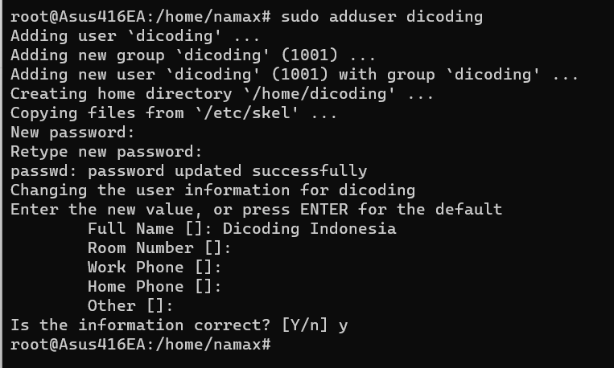

# Kriteria 1: Membuat User Baru
Untuk mengerjakan Proyek Akhir ini, kriteria pertama yang wajib Anda lakukan adalah membuat regular user baru. Silakan buat user baru dengan ketentuan sebagai berikut.

```
Username: dicoding
Full Name: Dicoding Indonesia
```


# Kriteria 2: Mengonfigurasi SSH

1. Melakukan remote login menggunakan protokol SSH dari user yang Anda pakai saat ini (selanjutnya disebut mesin pertama) ke alamat localhost dengan user bernama dicoding (selanjutnya disebut mesin kedua) melalui mekanisme password.
2. Buatlah key pair pada mesin pertama, lalu salin public key ke mesin kedua, kemudian lakukan remote login ke mesin kedua.
3. Ubah konfigurasi SSH pada mesin pertama agar:

    * Autentikasi hanya via public key.
    * Autentikasi tidak bisa via password.
    * Port SSH menjadi 2000.
    * Remote login tidak boleh menggunakan root.

4. Setelah itu, remote login ke mesin kedua.
5. Pastikan semua aktivitas di atas benar Anda lakukan dan berhasil karena akan tercatat pada berkas log.

# Kriteria 3: 
Membuat Berkas Daftar User dan Log SSH 
Setelah menyelesaikan dua kriteria sebelumnya, sekarang Anda diminta untuk membuat 2 berkas:

* daftar-user.txt -> Berisi daftar user yang ada di sistem Linux Anda. Untuk membuktikan bahwa Anda menyelesaikan Kriteria 1.
* log-ssh.txt -> Berisi entri log terkait SSH. Untuk membuktikan bahwa Anda menyelesaikan Kriteria 2.
