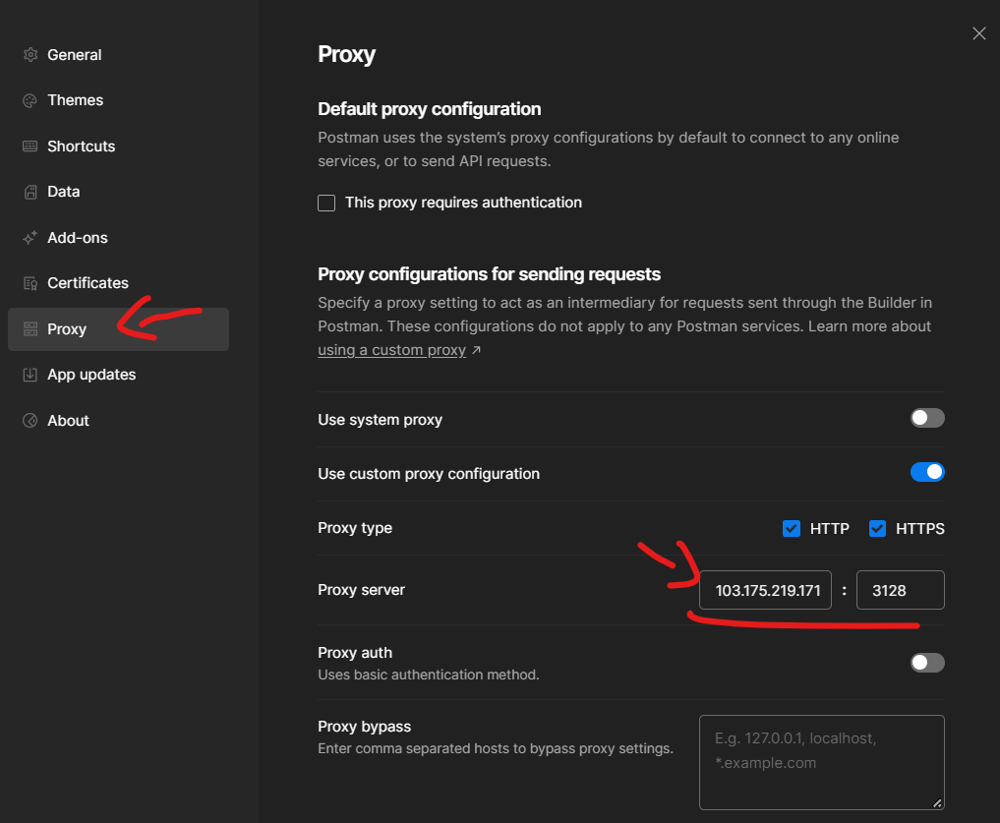
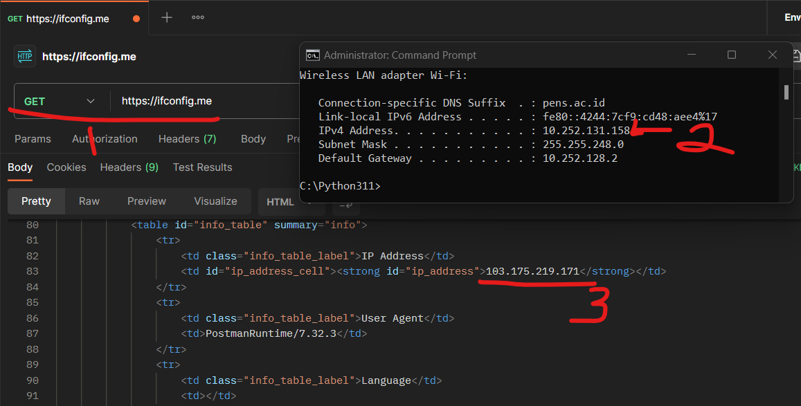

# Tutorial instalasi squid proxy di ubuntu menggunakan docker

1. Install Squid menggunakan docker command
    ```
    docker run -d --name squid_1 -e TZ=Asia/Jakarta -p 3128:3128 ubuntu/squid:5.2-22.04_beta
    ```
1. Izinkan firewall
    ```
    ufw allow 3128
    ```
1. masuk ke container
    ```
    docker exec -it squid_1 /bin/bash
    ```
1. lakukan update
    ```
    apt update
    ```
1. install nano
    ```
    apt install nano
    ```
1. backup `squid.conf`
    ```
    cp /etc/squid/squid.conf /etc/squid/squid.conf.backup
    ```
1. konfigurasi `squid.conf`
    ```
    nano /etc/squid/squid.conf
    ```
    cari baris berikut, untuk mempercepat gunakan `ctrl+w` pada IDE nano.
    ```
    # Example rule allowing access from your local networks.
    # Adapt localnet in the ACL section to list your (internal) IP networks
    # from where browsing should be allowed
    #http_access allow localnet

    # start edited
    http_access allow SSL_ports
    http_access allow Safe_ports
    # end edited

    http_access allow localhost
    ```
    masukkan `http_access allow SSL_ports` dan `http_access allow Safe_ports`
1. save end exit
    - `ctrl-x`
    - `y`
    - `enter`
    ```
    exit
    ```
    untuk keluar dari container
1. restart docker dari host
    ```
    docker restart squid_1
    ```
1. cek log (optional)
    ```
     nano /var/log/squid/access.log
    ```
    > pastikan sudah masuk ke dalam container, cek step ke-3
1. testing
    
    
   
    - 1. gambar.1 mengecek ip laptop kita dengan mengunjungi website https://ifconfig.me/
    - 2. gambar.2 adalah IP laptop saya
    - 3. gambar.3 adalah IP saya yang terdetek oleh internet.
    > artinya, laptop saya memiliki IP `10.252.131.158`, server proxy saya memiliki IP `103.175.219.171`. Tetapi ketika saya konek ke internet dan mengecek IP saya, saya terdeteksi menggunakan IP proxy. Konfigurasi berhasil

## Konfigurasi diatas dilakukan testing menggunakan Postman, lalu bagaimana jika ingin menerapkannya pada web browser?    

1. comming soon
1. step 1
1. step 1
1. step 1
1. step 1

