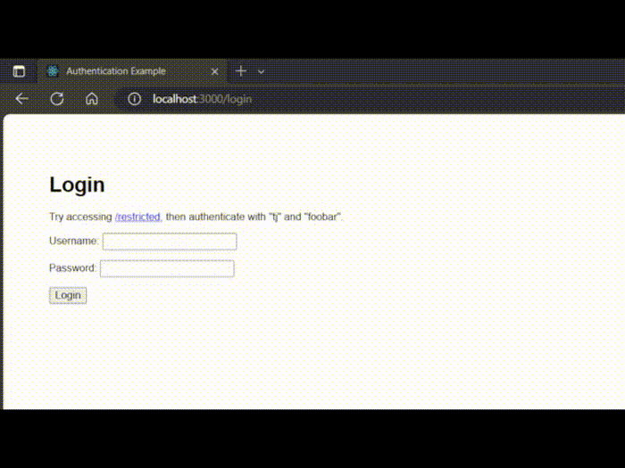

# Auth express.js
Autentikasi express.js menggunakan bcrypt dengan data lokal tanpa database.\
username: `tj` \
password: `foobar`

# Cara penggunaan
1. Download file `2. Auth bcrypt`.
1. Buka dengan IDE.
1. Jalankan 
    ```
    npm install
    ``` 
    untuk instalasi library.
1. Jalankan
    ```
    npm start
    ```
    untuk menjalakan.
1. selesai.

# Hasil


# Semoga berhasil 😁👍👍
