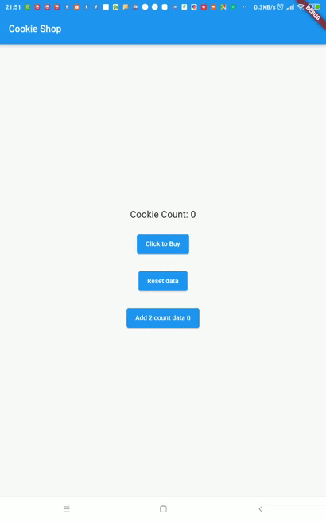
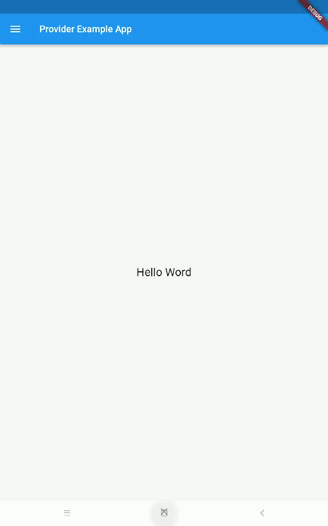

# Flutter provider

## Contoh 1 CookieProvider
- Hasil



- providers/cookie_provider.dart
```
import 'package:flutter/material.dart';

class CookieProvider extends ChangeNotifier {
  int _cookieCount = 0;
  int get cookieCount => _cookieCount;

  void buyCookie() {
    ++_cookieCount;
    notifyListeners();
  }

  void resetCount() {
    _cookieCount = 0;
    notifyListeners();
  }

  void addTwoCount(){
    _cookieCount += 2;
    notifyListeners();
  }
}

```

- pages/cookie_page.dart
```
import 'package:flutter/material.dart';
import 'package:flutter_provider_latihan_chatgpt/providers/cookie_provider.dart';
import 'package:provider/provider.dart';

class CookiePage extends StatelessWidget {
  const CookiePage({super.key});

  @override
  Widget build(BuildContext context) {
    return Scaffold(
      appBar: AppBar(
        title: const Text("Cookie Shop"),
      ),
      body: Row(
        mainAxisAlignment: MainAxisAlignment.center,
        children: [
          Column(
            mainAxisAlignment: MainAxisAlignment.center,
            children: [
              Consumer<CookieProvider>(
                builder: (context, value, child) {
                  return Text(
                    'Cookie Count: ${value.cookieCount}',
                    style: const TextStyle(fontSize: 20),
                  );
                },
              ),
              const SizedBox(
                height: 20,
              ),
              ElevatedButton(
                onPressed: () {
                  Provider.of<CookieProvider>(context, listen: false)
                      .buyCookie();
                },
                child: const Text("Click to Buy"),
              ),
              const SizedBox(
                height: 20,
              ),
              ElevatedButton(
                onPressed: () {
                  Provider.of<CookieProvider>(context, listen: false)
                      .resetCount();
                },
                child: const Text("Reset data"),
              ),
              const SizedBox(
                height: 20,
              ),
              ElevatedButton(
                onPressed: () {
                  Provider.of<CookieProvider>(context, listen: false)
                      .addTwoCount();
                },
                child: Consumer<CookieProvider>(
                    builder: (context, valueAddTwoCount, child) {
                  return Text(
                      "Add 2 count data ${valueAddTwoCount.cookieCount}");
                }),
              )
            ],
          )
        ],
      ),
    );
  }
}

```
- main.dart
```
import 'package:flutter/material.dart';
import 'package:flutter_provider_latihan_chatgpt/pages/cookie_page.dart';
import 'package:flutter_provider_latihan_chatgpt/providers/cookie_provider.dart';
import 'package:provider/provider.dart';

void main() {
  runApp(const MyApp());
}

class MyApp extends StatelessWidget {
  const MyApp({super.key});
  @override
  Widget build(BuildContext context) {

    return ChangeNotifierProvider(
      create: (context) => CookieProvider(),
      child: const MaterialApp(
        title: 'Cookie Shop',
        home: CookiePage(),
      ),
    );
  }
}

```

## contoh 2 ItemListPage 
- Result



- Tree file `lib`
```
C:.
│   main.dart
│
├───models
│       item_models.dart
│
├───pages
│   │   cookie_page.dart
│   │   home_page.dart
│   │
│   └───item
│           create_item_page.dart
│           list_item_page.dart
│
├───providers
│       cookie_provider.dart
│       item_provider.dart
│
└───widgets
        drawer_widget.dart
```

- Documentation file

    [lib-list-item-provider.zip](./src-example/lib-list-item-provider.zip)


## Penggunaan Multi PRovider
```
return MultiProvider(
      providers: [
        ChangeNotifierProvider(create: (context) => CookieProvider()),
        ChangeNotifierProvider(create: (context) => ItemProvider()),
      ],
      child: MaterialApp(
        title: 'MultiProvider Example',
        home: HomePage(),
      ),
    );
```