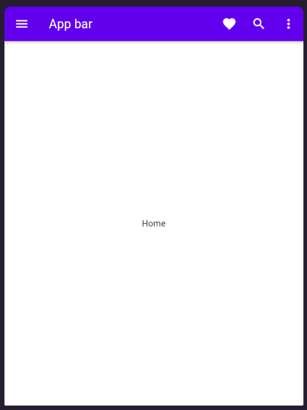

# Flutter Widget Documentation
[https://gallery.flutter.dev/#/](https://gallery.flutter.dev/#/)

## Menu

- [Struktur folder](#struktur-folder)
- [Tipografi](#tipografi)
- [AppBar](#app-bar)
- [Row](#row)
- [Column](#column)
- [Banner](#banner)
- [Bottom app bar](#bottom-app-bar)
- [Bottom navigation](#bottom-navigation)
- [Bottom sheet](#bottom-sheet)
- [Buttons](#buttons)
- [Cards](#cards)
- [Chips](#chips)
- [Data tables](#data-tables)
- [Dialogs](#dialogs)
- [Divider](#divider)
- [Grid lists](#grid-lists)
- [Lists](#lists)
- [Menu](#menu)
- [Navigation drawer](#navigation-drawer)
- [Navigation rail](#navigation-rail)
- [Pickers](#pickers)
- [Progress indicators](#progress-indicators)
- [Selection controls](#selection-controls)
- [Sliders](#sliders)
- [Snackbars](#snackbars)
- [Tabs](#tabs)
- [Text fields](#text-fields)
- [Tooltips](#tootips)

## Struktur folder
- [Menu](#menu)
- contoh 1
```
lib/
├── main.dart
├── routes.dart
├── theme.dart
├── providers/
│   ├── counter_provider.dart
│   └── user_provider.dart
├── models/
│   ├── user.dart
│   ├── post.dart
│   └── ...
├── screens/
│   ├── home/
│   │   ├── home_screen.dart
│   │   ├── components/
│   │   │   ├── banner_component.dart
│   │   │   ├── product_list_component.dart
│   │   │   └── ...
│   ├── profile/
│   │   ├── profile_screen.dart
│   │   ├── settings_screen.dart
│   │   └── ...
│   └── ...
├── widgets/
│   ├── custom_button.dart
│   ├── avatar.dart
│   └── ...
└── utils/
    ├── constants.dart
    ├── helpers.dart
    └── ...

```

## Tipografi
[Menu](#menu)

- nama file `my_file.dart`
- nama class `User`,`ProductModel`
- method dan function `calculateTotal()`,`getUserData()`
- variable `userName`,`productList`
- konstanta `MAX_VALUE`,`API_KEY`,`DEFAULT_TIMEOUT`
- enum `Color`,`StatusType`,`UserRole`


## App bar
- [Menu](#menu)

The App bar provides content and actions related to the current screen. It's used for branding, screen titles, navigation, and actions

```
// Copyright 2019 The Flutter team. All rights reserved.
// Use of this source code is governed by a BSD-style license that can be
// found in the LICENSE file.

import 'package:flutter/material.dart';
import 'package:flutter_gen/gen_l10n/gallery_localizations.dart';

class AppBarDemo extends StatelessWidget {
  const AppBarDemo({super.key});

  @override
  Widget build(BuildContext context) {
    var localization = GalleryLocalizations.of(context)!;
    return Scaffold(
      appBar: AppBar(
        leading: IconButton(
          tooltip: MaterialLocalizations.of(context).openAppDrawerTooltip,
          icon: const Icon(Icons.menu),
          onPressed: () {},
        ),
        title: Text(
          localization.demoAppBarTitle,
        ),
        actions: [
          IconButton(
            tooltip: localization.starterAppTooltipFavorite,
            icon: const Icon(
              Icons.favorite,
            ),
            onPressed: () {},
          ),
          IconButton(
            tooltip: localization.starterAppTooltipSearch,
            icon: const Icon(
              Icons.search,
            ),
            onPressed: () {},
          ),
          PopupMenuButton<Text>(
            itemBuilder: (context) {
              return [
                PopupMenuItem(
                  child: Text(
                    localization.demoNavigationRailFirst,
                  ),
                ),
                PopupMenuItem(
                  child: Text(
                    localization.demoNavigationRailSecond,
                  ),
                ),
                PopupMenuItem(
                  child: Text(
                    localization.demoNavigationRailThird,
                  ),
                ),
              ];
            },
          )
        ],
      ),
      body: Center(
        child: Text(
          localization.cupertinoTabBarHomeTab,
        ),
      ),
    );
  }
}
```


## Row
- [Menu](#menu)


## Column
- [Menu](#menu)


## Banner
- [Menu](#menu)

## Bottom app bar
- [Menu](#menu)


## Bottom navigation
- [Menu](#menu)

## Bottom sheet
- [Menu](#menu)

## Buttons
- [Menu](#menu)

## Cards
- [Menu](#menu)

## Chips
- [Menu](#menu)

## Data tables
- [Menu](#menu)

## Dialogs
- [Menu](#menu)

## Divider
- [Menu](#menu)

## Grid lists
- [Menu](#menu)

## Lists
- [Menu](#menu)

## Menu
- [Menu](#menu)

## Navigation drawer
- [Menu](#menu)

## Navigation rail
- [Menu](#menu)

## Pickers
- [Menu](#menu)

## Progress indicators
- [Menu](#menu)

## Selection controls
- [Menu](#menu)

## Sliders
- [Menu](#menu)

## Snackbars
- [Menu](#menu)

## Tabs
- [Menu](#menu)

## Text fields
- [Menu](#menu)

## Tooltips
- [Menu](#menu)


## Anonymous function and Lambda function
- [Menu](#menu)
- `(context, value, child) {}` **adalah contoh dari penggunaan blok kode di dalam fungsi anonim**. Anda dapat menuliskan beberapa pernyataan di dalam blok kurung kurawal `{}` dan bahkan dapat mengembalikan nilai jika diperlukan
    - contoh
        ```
        (context, value, child) {
          // Beberapa pernyataan di sini
          return value + 1;
        }
        ```
- `(context, value, child) =>` **adalah contoh dari penggunaan ekspresi lambda.** Jika anda hanya memiliki satu pernyataan sederhana untuk dievaluasi dan/atau mengembalikan nilai. Anda tidak perlu menuliskan kata kunci `return` karena ekspresi lambda secara otomatis mengembalikan nilai yang dievaluasi.
    - contoh
        ```
        (context, value, child) => value + 1
        ```


