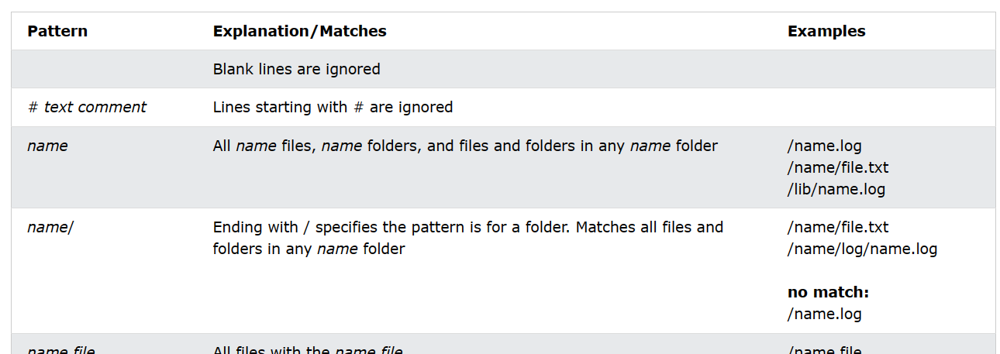

# Belajar Git

## Git Version
```
git --version
```
## Configure Git
```
git config --global user.name "widiarrohman1234"
git config --global user.email "widiarrohman1234@gmail.com"
```
## Initialize Git
```
git init
```
## Git status
```
git status
```
```
git status --short
```
dokumentasi dari git cli
```
usage: git status [<options>] [--] [<pathspec>...]

    -v, --verbose         be verbose
    -s, --short           show status concisely
    -b, --branch          show branch information
    --show-stash          show stash information
    --ahead-behind        compute full ahead/behind values
    --porcelain[=<version>]
                          machine-readable output
    --long                show status in long format (default)
    -z, --null            terminate entries with NUL
    -u, --untracked-files[=<mode>]
                          show untracked files, optional modes: all, normal, no. (Default: all)
    --ignored[=<mode>]    show ignored files, optional modes: traditional, matching, no. (Default: traditional)
    --ignore-submodules[=<when>]
                          ignore changes to submodules, optional when: all, dirty, untracked. (Default: all)
    --column[=<style>]    list untracked files in columns
    --no-renames          do not detect renames
    -M, --find-renames[=<n>]
                          detect renames, optionally set similarity index
```

## Git Staging Environment
### Add to staging environment
```
git add index.html
```
### Git Add More than One File
long command
```
git add --all
```
short command
```
git add -A
```

## Git Commit
```
git commit -m "first commit"
```
Commit the updated files directly, skipping the staging environment:
```
git commit -a -m "first commit"
```

## Git log
default log
```
git log
```
hanya menampilkan 1 baris saja
```
git log --oneline
```
## Git help
Ganti command dengan `status`, `commmit` atau lainnya
```
git command -help
```
Untuk melihat semua perintah
```
git help --all
```
yang akan muncul
```
Main Porcelain Commands
   add                     Add file contents to the index
   am                      Apply a series of patches from a mailbox
   archive                 Create an archive of files from a named tree
   bisect                  Use binary search to find the commit that introduced a bug
   branch                  List, create, or delete branches
   bundle                  Move objects and refs by archive
   checkout                Switch branches or restore working tree files
   cherry-pick             Apply the changes introduced by some existing commits
   citool                  Graphical alternative to git-commit
   clean                   Remove untracked files from the working tree
   clone                   Clone a repository into a new directory
   commit                  Record changes to the repository
   describe                Give an object a human readable name based on an available ref
   diff                    Show changes between commits, commit and working tree, etc
   fetch                   Download objects and refs from another repository
   format-patch            Prepare patches for e-mail submission
   gc                      Cleanup unnecessary files and optimize the local repository
   gitk                    The Git repository browser
   grep                    Print lines matching a pattern
   gui                     A portable graphical interface to Git
   init                    Create an empty Git repository or reinitialize an existing one
   log                     Show commit logs
   maintenance             Run tasks to optimize Git repository data
   merge                   Join two or more development histories together
   mv                      Move or rename a file, a directory, or a symlink
   notes                   Add or inspect object notes
   pull                    Fetch from and integrate with another repository or a local branch
   push                    Update remote refs along with associated objects
   range-diff              Compare two commit ranges (e.g. two versions of a branch)
   rebase                  Reapply commits on top of another base tip
   reset                   Reset current HEAD to the specified state
   restore                 Restore working tree files
   revert                  Revert some existing commits
   rm                      Remove files from the working tree and from the index
   scalar                  A tool for managing large Git repositories
   shortlog                Summarize 'git log' output
   show                    Show various types of objects
   sparse-checkout         Reduce your working tree to a subset of tracked files
   stash                   Stash the changes in a dirty working directory away
   status                  Show the working tree status
   submodule               Initialize, update or inspect submodules
   switch                  Switch branches
   tag                     Create, list, delete or verify a tag object signed with GPG
   worktree                Manage multiple working trees

Ancillary Commands / Manipulators
   config                  Get and set repository or global options
   fast-export             Git data exporter
   fast-import             Backend for fast Git data importers
   filter-branch           Rewrite branches
   mergetool               Run merge conflict resolution tools to resolve merge conflicts
   pack-refs               Pack heads and tags for efficient repository access
   prune                   Prune all unreachable objects from the object database
   reflog                  Manage reflog information
   remote                  Manage set of tracked repositories
   repack                  Pack unpacked objects in a repository
   replace                 Create, list, delete refs to replace objects

Ancillary Commands / Interrogators
   annotate                Annotate file lines with commit information
   blame                   Show what revision and author last modified each line of a file
   bugreport               Collect information for user to file a bug report
   count-objects           Count unpacked number of objects and their disk consumption
   diagnose                Generate a zip archive of diagnostic information
   difftool                Show changes using common diff tools
   fsck                    Verifies the connectivity and validity of the objects in the database
   gitweb                  Git web interface (web frontend to Git repositories)
   help                    Display help information about Git
   instaweb                Instantly browse your working repository in gitweb
   merge-tree              Perform merge without touching index or working tree
   rerere                  Reuse recorded resolution of conflicted merges
   show-branch             Show branches and their commits
   verify-commit           Check the GPG signature of commits
   verify-tag              Check the GPG signature of tags
   version                 Display version information about Git
   whatchanged             Show logs with difference each commit introduces

Interacting with Others
   archimport              Import a GNU Arch repository into Git
   cvsexportcommit         Export a single commit to a CVS checkout
   cvsimport               Salvage your data out of another SCM people love to hate
   cvsserver               A CVS server emulator for Git
   imap-send               Send a collection of patches from stdin to an IMAP folder
   p4                      Import from and submit to Perforce repositories
   quiltimport             Applies a quilt patchset onto the current branch
   request-pull            Generates a summary of pending changes
   send-email              Send a collection of patches as emails
   svn                     Bidirectional operation between a Subversion repository and Git

Low-level Commands / Manipulators
   apply                   Apply a patch to files and/or to the index
   checkout-index          Copy files from the index to the working tree
   commit-graph            Write and verify Git commit-graph files
   commit-tree             Create a new commit object
   hash-object             Compute object ID and optionally creates a blob from a file
   index-pack              Build pack index file for an existing packed archive
   merge-file              Run a three-way file merge
   merge-index             Run a merge for files needing merging
   mktag                   Creates a tag object with extra validation
   mktree                  Build a tree-object from ls-tree formatted text
   multi-pack-index        Write and verify multi-pack-indexes
   pack-objects            Create a packed archive of objects
   prune-packed            Remove extra objects that are already in pack files
   read-tree               Reads tree information into the index
   symbolic-ref            Read, modify and delete symbolic refs
   unpack-objects          Unpack objects from a packed archive
   update-index            Register file contents in the working tree to the index
   update-ref              Update the object name stored in a ref safely
   write-tree              Create a tree object from the current index

Low-level Commands / Interrogators
   cat-file                Provide content or type and size information for repository objects
   cherry                  Find commits yet to be applied to upstream
   diff-files              Compares files in the working tree and the index
   diff-index              Compare a tree to the working tree or index
   diff-tree               Compares the content and mode of blobs found via two tree objects
   for-each-ref            Output information on each ref
   for-each-repo           Run a Git command on a list of repositories
   get-tar-commit-id       Extract commit ID from an archive created using git-archive
   ls-files                Show information about files in the index and the working tree
   ls-remote               List references in a remote repository
   ls-tree                 List the contents of a tree object
   merge-base              Find as good common ancestors as possible for a merge
   name-rev                Find symbolic names for given revs
   pack-redundant          Find redundant pack files
   rev-list                Lists commit objects in reverse chronological order
   rev-parse               Pick out and massage parameters
   show-index              Show packed archive index
   show-ref                List references in a local repository
   unpack-file             Creates a temporary file with a blob's contents
   var                     Show a Git logical variable
   verify-pack             Validate packed Git archive files

Low-level Commands / Syncing Repositories
   daemon                  A really simple server for Git repositories
   fetch-pack              Receive missing objects from another repository
   http-backend            Server side implementation of Git over HTTP
   send-pack               Push objects over Git protocol to another repository
   update-server-info      Update auxiliary info file to help dumb servers

Low-level Commands / Internal Helpers
   check-attr              Display gitattributes information
   check-ignore            Debug gitignore / exclude files
   check-mailmap           Show canonical names and email addresses of contacts
   check-ref-format        Ensures that a reference name is well formed
   column                  Display data in columns
   credential              Retrieve and store user credentials
   credential-cache        Helper to temporarily store passwords in memory
   credential-store        Helper to store credentials on disk
   fmt-merge-msg           Produce a merge commit message
   hook                    Run git hooks
   interpret-trailers      Add or parse structured information in commit messages
   mailinfo                Extracts patch and authorship from a single e-mail message
   mailsplit               Simple UNIX mbox splitter program
   merge-one-file          The standard helper program to use with git-merge-index
   patch-id                Compute unique ID for a patch
   sh-i18n                 Git's i18n setup code for shell scripts
   sh-setup                Common Git shell script setup code
   stripspace              Remove unnecessary whitespace

User-facing repository, command and file interfaces
   attributes              Defining attributes per path
   cli                     Git command-line interface and conventions
   hooks                   Hooks used by Git
   ignore                  Specifies intentionally untracked files to ignore
   mailmap                 Map author/committer names and/or E-Mail addresses
   modules                 Defining submodule properties
   repository-layout       Git Repository Layout
   revisions               Specifying revisions and ranges for Git

Developer-facing file formats, protocols and other interfaces
   format-bundle           The bundle file format
   format-chunk            Chunk-based file formats
   format-commit-graph     Git commit-graph format
   format-index            Git index format
   format-pack             Git pack format
   format-signature        Git cryptographic signature formats
   protocol-capabilities   Protocol v0 and v1 capabilities
   protocol-common         Things common to various protocols
   protocol-http           Git HTTP-based protocols
   protocol-pack           How packs are transferred over-the-wire
   protocol-v2             Git Wire Protocol, Version 2

External commands
   askpass
   askyesno
   credential-helper-selector
   credential-manager
   credential-manager-core
   credential-manager-ui
   flow
   lfs
   update-git-for-windows
```

## Git Branch
### New git branch
```
git branch hello-world-images
```
### Check list branch
branch aktif saat ini
```
git branch
```
list branch di local
```
git branch -a
```
List only remote branches of the current Git.
```
git branch -r
```
### Pindah branch
ganti `hello-world-images` dengan nama branch tujuan
```
git checkout hello-world-images
```
Create, and move to a new branch with the name `emergency-fix`
```
git checkout -b emergency-fix
```
### Hapus branch
```
git branch -d emergency-fix
```

### Git Branch Merge
menyatukan code, posisi saat ini ada di branch `master`, 
> Ketika menjalankan perintah `git merge emergency-fix` maka akan **MEMASUKKAN SEMUA KODE YANG ADA DI `emergency-fix` KE BRANCH SAAT INI `master`**.
```
git merge emergency-fix
```

## Git GitHub Getting Started
- buat repo di github
- lakukan remote dengan printah dibawah ini
```
git remote add origin https://github.com/widiarrohman1234/me.git
```
- `push` kode yang sudah dibuat ke origin url
```
git push --set-upstream origin master
```

## Git Pull from GitHub
> `pull` adalah kombinasi dari `fetch` dan `merge`

### Git fetch (mengambil)
`fetch` memanggil semua riwayat perubahan dari branch/repo.
> Jadi, di git lokal saya akan mengambil semua pembaruan yang ada pada github.

perintah dibawah akan memanggil semua riwayat perubahan dari branch origin pada github
```
git fetch origin
```

### Git Merge (menggabungkan)
menggabungkan branch saat ini dengan branch yang telah ditentukan.
saat ini saya berada pada branch `master`, setelah menjalankan syntax dibawah, maka branch `master` di local saya akan digabungkan dengan `origin/master`
```
git merge origin/master
```
### Git Pull
`pull` adalah kombinasi dari `fetch` dan `merge`
```
git pull origin
```

## Git Push to GitHub
mengirim dari local ke github
```
git push origin
```

## Git Push Branch from GitHub
`update-readme` adalah branch di local yang akan di push ke github
```
git push origin update-readme
```

## Git Clone
```
git clone https://github.com/widiarrohman124/me.git
```
git clone to folder
```
git clone https://github.com/widiarrohman124/me.git portofolio-me
```

### Configuring Remotes
```
$ git remote -v
    origin  https://github.com/w3schools-test/w3schools-test.github.io.git (fetch)
    origin  https://github.com/w3schools-test/w3schools-test.github.io.git (push)
```
```
$ git remote rename origin upstream
$ git remote -v
    upstream        https://github.com/w3schools-test/w3schools-test.github.io.git (fetch)
    upstream        https://github.com/w3schools-test/w3schools-test.github.io.git (push)
```
```
$ git remote add origin https://github.com/kaijim/w3schools-test.github.io.git
$ git remote -v
    origin  https://github.com/kaijim/w3schools-test.github.io.git (fetch)
    origin  https://github.com/kaijim/w3schools-test.github.io.git (push)
    upstream        https://github.com/w3schools-test/w3schools-test.github.io.git (fetch)
    upstream        https://github.com/w3schools-test/w3schools-test.github.io.git (push)
```
Now we have 2 remotes:
- `origin` - `fork` kita sendiri, tempat kita memiliki akses baca dan tulis
- `upstream` - yang asli, di mana kami memiliki akses hanya baca

## Git GitHub Send Pull Request from forking and Approving Pull Requests
dilakukan pada GUI Github, tidak pada CLI.
- [https://www.w3schools.com/git/git_remote_send_pull_request.asp?remote=github](https://www.w3schools.com/git/git_remote_send_pull_request.asp?remote=github)

## Git Ignore and .gitignore
daftar perintah `.gitignore`
- Pelajari lebih lanjut di: [https://www.w3schools.com/git/git_ignore.asp?remote=github](https://www.w3schools.com/git/git_ignore.asp?remote=github)




## Git Revert (Kembali)
revert the latest commit:
```
git revert HEAD
```
revert the latest commit, skipping the commit message editor:
```
git revert HEAD --no-edit
```
kembalikan dua komitmen terakhir:
ganti angka `2` sesuai kebutuhan
```
git revert HEAD~2
```

## Git Reset
`9a9add8` diambil dari nomor commit, masukkan perintah `git log --oneline` untuk melihatnya.
```
git reset 9a9add8
```

## Git Amend (Mengubah)
mengubah nama commit yang salah
```
git commit --amend -m "Updated index"
```


