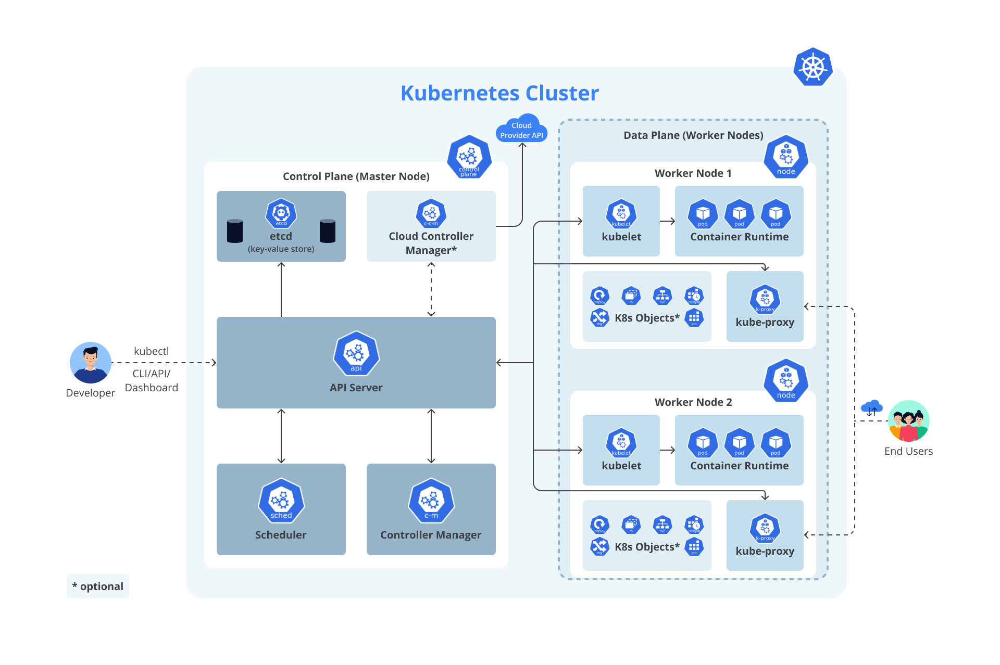
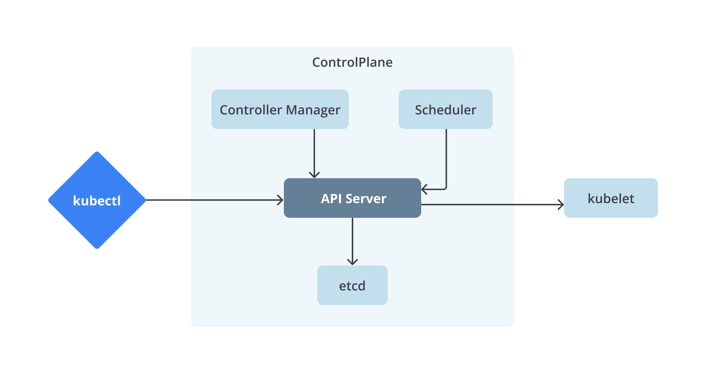
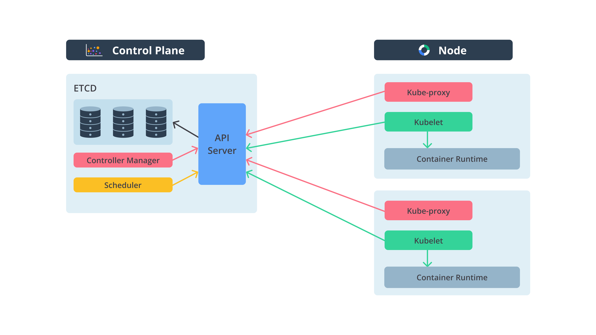

# Kubernetes: Pengelolaan Container Secara Otomatis dan Efisien

Kubernetes adalah platform orkestrasi container open-source yang digunakan untuk mengelola aplikasi yang dijalankan di dalam container secara otomatis, termasuk pengaturan dan koordinasi sumber daya. Kubernetes bekerja dengan cara menggabungkan satu atau lebih container ke dalam sebuah grup yang disebut **Pod** di mesin host (disebut **Node**), kemudian mengelola sumber daya dengan lebih efisien.

## Terminologi Kubernetes

### 1. Pod
- **Pod** adalah unit terkecil di Kubernetes dan dapat terdiri dari satu atau lebih container yang dikelompokkan bersama dalam satu jaringan dan berbagi resource.
- Container dalam Pod biasanya berbagi alamat IP dan namespace yang sama sehingga memungkinkan komunikasi yang mudah di antara container tersebut.

### 2. Node
- **Node** adalah mesin fisik atau virtual yang berfungsi sebagai host untuk menjalankan Pod.
- Setiap Node memiliki komponen yang disebut **Kubelet**, yang bertugas mengelola status Node. Kubelet menerima perintah dari **Kubernetes API Server** untuk memulai, menghentikan, dan memelihara container di Node tersebut.

### 3. Cluster
- **Cluster** adalah kumpulan dari satu atau lebih Node.
- Dalam sebuah Cluster Kubernetes, terdapat **Control Plane (Master Node)** yang mengelola Pod di seluruh Node dalam Cluster.
  - Control Plane bertanggung jawab atas scheduling, menjaga status sistem, mengelola storage, dan menjaga ketersediaan aplikasi.
  - **Worker Node** adalah Node yang menjalankan Pod dan melakukan tugas yang diperintahkan oleh Control Plane.

### 4. Komponen Kubernetes
- **Kubelet**: Komponen agen yang berjalan di setiap Node untuk memastikan container dikelola dan dikendalikan oleh Control Plane.
- **kubectl (Kube Control)**: CLI Kubernetes yang digunakan oleh developer atau administrator untuk berkomunikasi dan melakukan konfigurasi terhadap Cluster Kubernetes.
- **Minikube**: Tools untuk membuat Kubernetes Cluster lokal dengan cepat, terutama digunakan dalam lingkungan pengembangan.
- **Kind (Kubernetes-in-Docker)**: Tools yang digunakan untuk membuat Cluster Kubernetes di dalam container Docker, ideal untuk pengujian atau pengembangan aplikasi.
- **kubeadm**: Tools untuk membuat dan mengelola Kubernetes Cluster dengan mudah, lebih sering digunakan untuk setting produksi.

## Deployment, Replica, dan ReplicaSet
- **Replica**: Object YAML yang mendefinisikan Pod dan jumlah instance container yang diinginkan.
- **ReplicaSet**: Object yang memastikan jumlah replica yang diinginkan dijalankan dalam Cluster. Jika ada Pod yang mati, **ReplicaSet** akan meluncurkan Pod pengganti.
- **Deployment**: Deployment mengelola **ReplicaSet** dan mendefinisikan template Pod, update strategi, rollback, dan sebagainya. Deployment adalah cara yang paling umum untuk melakukan manajemen container di Kubernetes.

## Fitur Kubernetes

### 1. Service Discovery
- Kubernetes menyediakan **service discovery**, di mana satu **service** dapat menemukan **service** lain secara dinamis.
- Menggunakan **DNS name** atau **IP address**, container dapat berkomunikasi secara otomatis tanpa harus melakukan konfigurasi manual.

### 2. Load Balancing
- **Load Balancer** di Kubernetes mendistribusikan traffic yang masuk ke beberapa Pod untuk menjaga ketersediaan dan stabilitas aplikasi, terutama ketika traffic sangat tinggi.

### 3. Resource Allocation
- Mengalokasikan sumber daya seperti CPU dan memory agar penggunaan resource lebih optimal.
- Dapat memasang sistem penyimpanan seperti **local**, **persistent volumes**, dan **public cloud providers**.

### 4. Isolation
- Kubernetes mendukung **namespace** untuk mengisolasi resource yang berbeda dalam Cluster yang sama, misalnya untuk membedakan lingkungan development, staging, dan production.

### 5. Scalability
- Kubernetes memungkinkan **scaling** aplikasi dengan cepat, baik **horizontal scaling** (menambah jumlah Pod) maupun **vertical scaling** (menambah resource pada Pod tertentu).

### 6. Automatic Rollout and Rollback
- Kubernetes mendukung **automatic rollout** untuk melakukan deploy versi baru dari aplikasi secara bertahap tanpa downtime.
- Jika terdapat masalah pada versi baru, Kubernetes dapat melakukan **rollback** untuk mengembalikan ke versi lama.

### 7. Self-Healing
- Kubernetes mendukung fitur **self-healing**, yang dapat memulai ulang, mengganti, atau mematikan container yang gagal atau tidak berfungsi dengan baik.
- Pod yang belum siap tidak akan diarahkan untuk menerima traffic sampai benar-benar **ready**.

### 8. Secret and Configuration Management
- Kubernetes dapat menyimpan **informasi sensitif** seperti password, OAuth token, dan SSH key menggunakan objek **Secret**.
- **Secret** dan **Configuration** dapat diupdate tanpa perlu membangun ulang image container, sehingga mempermudah pengelolaan konfigurasi aplikasi.

### 9. CI/CD Pipeline Integration
- Kubernetes sering digunakan dalam pipeline **CI/CD** (Continuous Integration and Continuous Deployment) untuk mempermudah proses deployment otomatis, testing, dan rolling updates pada aplikasi.

## Alur Kerja Kubernetes

1. **Developer** menulis konfigurasi deployment di file **YAML** atau **JSON**.
2. File konfigurasi ini diterapkan menggunakan `kubectl`, di mana Cluster menerima definisi Pod dan Deployment yang diinginkan.
3. **Control Plane** akan memeriksa Node mana yang dapat menampung Pod baru berdasarkan resource yang ada.
4. Pod kemudian dibuat dan diatur oleh **Kubelet** di Node yang dipilih.
5. Jika ada masalah dengan Pod, Kubernetes memastikan Pod tersebut diluncurkan kembali atau dipindahkan ke Node lain yang aktif.

## Diagram Sederhana Kubernetes

## Rangkuman
- Kubernetes adalah platform orkestrasi container yang menggabungkan container dalam **Pod**, dan Pod dijalankan pada **Node**.
- **Control Plane** berfungsi untuk mengelola seluruh Cluster yang terdiri dari banyak **Node**.
- Dengan **kubelet**, setiap Node dapat menerima instruksi dari **Control Plane** untuk memulai, menghentikan, atau memelihara Pod.
- Kubernetes menawarkan fitur seperti **self-healing**, **scaling**, **service discovery**, dan **load balancing** untuk memastikan aplikasi dapat berjalan secara efisien dan dapat diandalkan.

Kubernetes adalah solusi yang sangat powerful untuk mengelola aplikasi berbasis container, terutama ketika harus dikelola dalam skala besar dan dengan kebutuhan pengelolaan resource yang kompleks.
