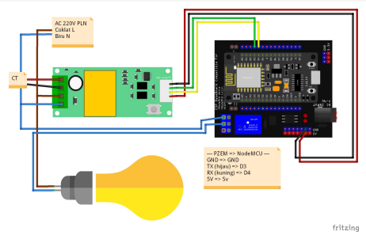
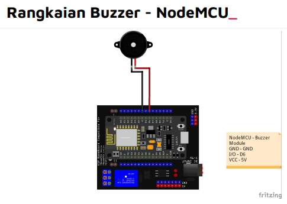
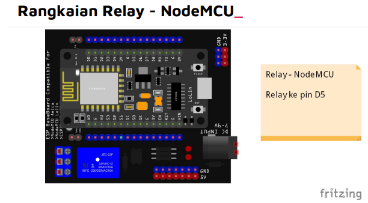

# Catatan KWH Meter

## Add Link Referensi ESP8266/ESP32
1. klik menu File, pilih Preferences
2. pada Additional Board Manager URLs
ESP32
```
https://raw.githubusercontent.com/espressif/arduino-esp32/gh-pages/package_esp32_index.json
```
ESP8266
```
https://arduino.esp8266.com/stable/package_esp8266com_index.json
```

Add Link Referensi ESP8266/ESP32_
1. klik menu `Tools`, pilih `Board`, pilih `Boards Manager`…
2. Cari `esp8266` pilih versi 2.7.4, klik Install
3. Cari `esp32` pilih versi 1.0.6, klik Install

Pilih Board
1. Tools, pilih Board, pilih ESP8266 Board, kemudian pilih NodeMCU 1.0

## Rangkaian


## Library PZEM_
1. Silakan Download: 
https://github.com/mandulaj/PZEM-004T-v30/archive/refs/heads/master.zip
2. Cara menambahkan library: 
https://kelasrobot.com/bagaimana-cara-memasukan-library-ke-aplikasi-arduino-ide/

contoh coding PZEM
```
#include <PZEM004Tv30.h>
PZEM004Tv30 pzem(D3, D4);

void setup() {
  Serial.begin(115200);
}

void loop() {
  float voltage = pzem.voltage();
  if ( !isnan(voltage) ) {
    Serial.print("Voltage: "); Serial.print(voltage); Serial.println("V");
  } else {
    Serial.println("Error reading voltage");
  }
  float current = pzem.current();
  if ( !isnan(current) ) {
    Serial.print("Current: "); Serial.print(current); Serial.println("A");
  } else {
    Serial.println("Error reading current");
  }
  float power = pzem.power();
  if ( !isnan(power) ) {
    Serial.print("Power: "); Serial.print(power); Serial.println("W");
  } else {
    Serial.println("Error reading power");
  }
  float energy = pzem.energy();
  if ( !isnan(energy) ) {
    Serial.print("Energy: "); Serial.print(energy); Serial.println("kWh");
  } else {
    Serial.println("Error reading energy");
  }
  float frequency = pzem.frequency();
  if ( !isnan(frequency) ) {
    Serial.print("Frequency: "); Serial.print(frequency, 1); Serial.println("Hz");
  } else {
    Serial.println("Error reading frequency");
  }
  float pf = pzem.pf();
  if ( !isnan(pf) ) {
    Serial.print("PF: "); Serial.println(pf);
  } else {
    Serial.println("Error reading power factor");
  }
  Serial.println();
  delay(2000);
}
```

## Rangkan dan Program Test LCD I2C 20x4

Library LCD I2C_
1. Silakan Download: 
https://www.dropbox.com/s/asp8w5ja64bn7u9/Arduino-LiquidCrystal-I2C-library-master.zip
2. Cara menambahkan library: 
https://kelasrobot.com/bagaimana-cara-memasukan-library-ke-aplikasi-arduino-ide/
3. Cek ke Documents/Arduino/Libraries, jika ada folder library LCD I2C yang lain, silakan hapus.
contoh coding
```
#include <LiquidCrystal_I2C.h>
LiquidCrystal_I2C lcd(0x27, 20, 4);
void setup() {
 lcd.begin();
}
void loop(){
 lcd.setCursor(0,0);
 lcd.print("TEST LCD i2C");
 lcd.setCursor(0,1);
 lcd.print("KelasRobot.com");
 lcd.setCursor(0,2);
 lcd.print("Belajar Robot Itu");
 lcd.setCursor(0,3);
 lcd.print("Mudah & Menyenangkan");
}
```
## Rangkain dan Program Test Buzzer Aktif

```
#define buzzer D6
void buzz(int jumlah, int Delay) {
 for (int i = 0; i < jumlah; i++) {
 digitalWrite(buzzer, HIGH);
 delay(Delay);
 digitalWrite(buzzer, LOW);
 delay(Delay);
 }
}
void setup() {
 pinMode(buzzer, OUTPUT);
 buzz(10, 500);
}
void loop() {
}
```
## Rangkaian dan Program Test Relay


contoh coding relay
```
void setup() {
 pinMode(D5, OUTPUT);
}
void loop() {
 digitalWrite(D5, HIGH);
 delay(3000);
 digitalWrite(D5, LOW);
 delay(3000);
}
```
## Program HTTP GET
contoh program
```
#include <ESP8266WiFi.h>
#include <ESP8266HTTPClient.h>
const char* ssid = "KelasRobot.com";
const char* password = "k3l4sr0b0t";
String url = "http://example.org";
void setup() {
 Serial.begin(115200);
 WiFi.begin(ssid, password);
 Serial.print("Connecting to WiFi");
 while (WiFi.status() != WL_CONNECTED) {
 delay(500); Serial.print(".");
 }
 Serial.print("OK! IP=");
 Serial.println(WiFi.localIP());
 HTTPClient http;
 http.begin(url);
 int httpResponseCode = http.GET();
 if (httpResponseCode > 0) {
 Serial.print("HTTP ");
 Serial.println(httpResponseCode);
 String payload = http.getString();
 Serial.println();
 Serial.println(payload);
 }
 else {
 Serial.print("Error code: ");
 Serial.println(httpResponseCode);
 Serial.println(":-(");
 }
}
void loop() {}
```

# Perhitungan

```
07:53:08.458 -> Mac Address: C4:5B:BE:73:EF:59
07:53:08.504 -> Voltage: 232.90 V
07:53:08.504 -> Current: 0.91 A
07:53:08.504 -> Power: 110.10 W
07:53:08.504 -> Energy: 5.92 Wh
07:53:08.504 -> Frequency: 50.0 Hz
07:53:08.504 -> PF: 0.52 
```

Data tersebut merupakan hasil pengukuran dan informasi terkait dengan suatu perangkat elektronik atau sistem yang terkait. Berikut adalah penjelasan untuk setiap informasi yang diberikan:

1. Mac Address: C4:5B:BE:73:EF:59
   Ini adalah alamat Media Access Control (MAC) yang unik untuk perangkat jaringan. MAC Address digunakan untuk mengidentifikasi perangkat yang terhubung dalam jaringan, seperti komputer atau perangkat IoT.

2. Voltage: 232.90 V
   Ini adalah tegangan listrik yang diukur pada saat pengukuran. Satuan tegangan biasanya diukur dalam Volt (V) dan menunjukkan tingkat potensial listrik di perangkat atau sistem tersebut.

3. Current: 0.91 A
   Ini adalah arus listrik yang diukur pada saat pengukuran. Satuan arus diukur dalam Ampere (A) dan menunjukkan seberapa besar aliran listrik melalui perangkat atau sistem tersebut.

4. Power: 110.10 W
   Ini adalah daya listrik yang diukur pada saat pengukuran. Satuan daya diukur dalam Watt (W) dan menunjukkan seberapa besar energi listrik yang digunakan oleh perangkat atau sistem tersebut.

5. Energy: 5.92 Wh
   Ini adalah energi listrik yang dikonsumsi atau dihasilkan oleh perangkat atau sistem sejak awal pengukuran. Satuan energi sering diukur dalam Watt-hour (Wh) dan mengindikasikan jumlah energi total yang telah digunakan atau dihasilkan.

6. Frequency: 50.0 Hz
   Ini adalah frekuensi listrik yang diukur pada saat pengukuran. Satuan frekuensi diukur dalam Hertz (Hz) dan menunjukkan jumlah siklus listrik yang terjadi dalam satu detik. Pada umumnya, frekuensi listrik adalah 50 Hz atau 60 Hz, tergantung pada negara atau wilayahnya.

7. PF: 0.52
   PF merupakan singkatan dari Power Factor. Ini adalah rasio antara daya aktif (real power) dengan daya semu (apparent power) dalam suatu sistem listrik. Power Factor menunjukkan efisiensi penggunaan daya listrik oleh perangkat atau sistem. Nilai PF yang lebih tinggi menunjukkan penggunaan daya yang lebih efisien. Dalam contoh ini, PF memiliki nilai 0.52.

# Contoh kasus
Untuk menghitung kWh (Kilowatt-hour) berdasarkan total energi yang dikumpulkan dalam satuan Wh (Watt-hour), Anda dapat mengikuti langkah-langkah berikut:

1. Jumlahkan semua nilai energi dalam Wh yang dikumpulkan selama 30 menit.
   Dalam kasus Anda, Anda mengumpulkan data setiap detik selama 30 menit. Oleh karena itu, jumlahkan semua nilai energi dalam Wh yang dikumpulkan selama 30 menit tersebut.

2. Bagi jumlah energi dalam Wh dengan 1000.
   Karena 1 kWh sama dengan 1000 Wh, Anda perlu membagi jumlah energi dalam Wh dengan 1000 untuk mendapatkan nilai dalam kWh.

Berikut adalah contoh perhitungan:

Jumlah total energi dalam Wh yang dikumpulkan selama 30 menit = 5.92 Wh (per detik) x 60 detik x 30 menit = 10,656 Wh

Kemudian, bagi jumlah energi dalam Wh dengan 1000:
10,656 Wh / 1000 = 10.656 kWh

Jadi, total energi yang dikumpulkan selama 30 menit adalah sekitar 10.656 kWh.

Perlu dicatat bahwa perhitungan ini asumsikan bahwa nilai energi Wh yang diberikan sudah dalam bentuk total energi selama 30 menit. Jika Anda ingin menghitung kWh berdasarkan energi per detik, Anda perlu mengalikan nilai energi per detik dengan jumlah detik yang diinginkan, kemudian bagi dengan 1000.