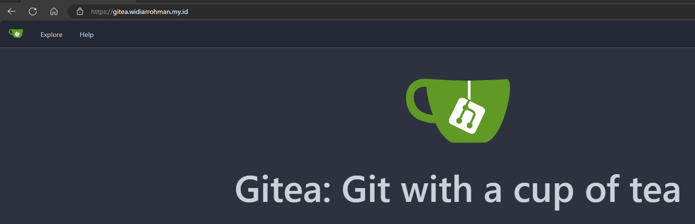
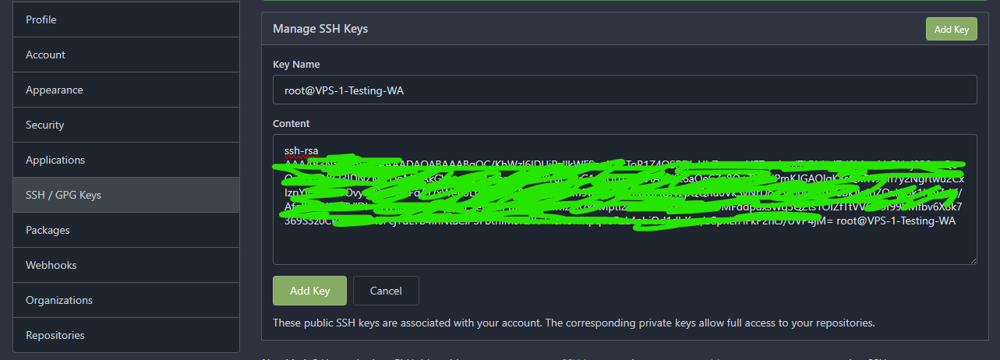

# Konfigurasi HTTPS nginx ubuntu docker-compose gitea
Dokumentasi pembelajaran devsecops untuk membuat server git.\
saya menggunakan:
- ubuntu sebagai OS server
- let's encrypt untuk sertifikat SSL
- docker-compose untuk Nginx
- gitea sebagai server git

> ## Dokumentasi adalah teman terbaik ketika bingung/lupa/stres 😁❤️.

## Buat sertifikat SSL
```shell
root@VPS-1-Testing-WA:/etc/letsencrypt/live# certbot certonly --standalone -d gitea.widiarrohman.my.id
Saving debug log to /var/log/letsencrypt/letsencrypt.log
Requesting a certificate for gitea.widiarrohman.my.id

- - - - - - - - - - - - - - - - - - - - - - - - - - - - - - - - - - - - - - - -
Could not bind TCP port 80 because it is already in use by another process on
this system (such as a web server). Please stop the program in question and then
try again.
- - - - - - - - - - - - - - - - - - - - - - - - - - - - - - - - - - - - - - - -
(R)etry/(C)ancel: R

Successfully received certificate.
Certificate is saved at: /etc/letsencrypt/live/gitea.widiarrohman.my.id/fullchain.pem
Key is saved at:         /etc/letsencrypt/live/gitea.widiarrohman.my.id/privkey.pem
This certificate expires on 2024-01-02.
These files will be updated when the certificate renews.
Certbot has set up a scheduled task to automatically renew this certificate in the background.

- - - - - - - - - - - - - - - - - - - - - - - - - - - - - - - - - - - - - - - -
If you like Certbot, please consider supporting our work by:
 * Donating to ISRG / Let's Encrypt:   https://letsencrypt.org/donate
 * Donating to EFF:                    https://eff.org/donate-le
- - - - - - - - - - - - - - - - - - - - - - - - - - - - - - - - - - - - - - - -

root@VPS-1-Testing-WA:/etc/letsencrypt/live/gitea.widiarrohman.my.id# ls
README  cert.pem  chain.pem  fullchain.pem  privkey.pem
```

## docker-compose.yml untuk gitea
```shell
root@VPS-1-Testing-WA:/home/widiarrohman1234/docker/gitea# cat docker-compose.yml
version: "2"

services:
  server:
    image: gitea/gitea:1.20.4-rootless
    environment:
      - GITEA__database__DB_TYPE=mysql
      - GITEA__database__HOST=103.175.219.171:3306
      - GITEA__database__NAME=gitea
      - GITEA__database__USER=********
      - GITEA__database__PASSWD=*********
    restart: always
    volumes:
      - ./data:/var/lib/gitea
      - ./config:/etc/gitea
      - /etc/timezone:/etc/timezone:ro
      - /etc/localtime:/etc/localtime:ro
    ports:
      - "3000:3000"
      - "2222:2222"
root@VPS-1-Testing-WA:/home/widiarrohman1234/docker/gitea#
```
setting chown
```
root@VPS-1-Testing-WA:/home/widiarrohman1234/docker/gitea# sudo chown 1000:1000 config/ data/
```

## Atur subdomain di `conf.d`
```shell
root@VPS-1-Testing-WA:/home/widiarrohman1234/docker/nginx-1/conf.d# cat gitea.conf
server {
    listen 80;
    server_name gitea.widiarrohman.my.id;

    location / {
        return 301 https://$host$request_uri;
    }
}

server {
    listen 443 ssl;
    server_name gitea.widiarrohman.my.id;

    ssl_certificate /etc/nginx/ssl/gitea/fullchain.pem;
    ssl_certificate_key /etc/nginx/ssl/gitea/privkey.pem;

    location / {
        proxy_pass http://103.175.219.171:3000;
        proxy_set_header Host $host;
        proxy_set_header X-Real-IP $remote_addr;
        proxy_set_header X-Forwarded-For $proxy_add_x_forwarded_for;
        proxy_set_header X-Forwarded-Proto $scheme;
    }
}
root@VPS-1-Testing-WA:/home/widiarrohman1234/docker/nginx-1/conf.d#
```

## Pengaturan `docker-compose.yml`
> ### Pastikan directory `/etc/nginx/ssl/gitea/` sudah ada pada docker nginx
```shell
root@VPS-1-Testing-WA:/home/widiarrohman1234/docker/nginx-1# cat docker-compose.yml
version: "3"

services:
  nginx-1:
    container_name: nginx-2
    image: nginx
    volumes:
      - /var/www/html:/usr/share/nginx/html
      - /home/widiarrohman1234/docker/nginx-1/conf.d:/etc/nginx/conf.d
      - /etc/letsencrypt/live/widiarrohman.my.id/fullchain.pem:/etc/nginx/ssl/fullchain.pem
      - /etc/letsencrypt/live/widiarrohman.my.id/privkey.pem:/etc/nginx/ssl/privkey.pem
      - /etc/letsencrypt/live/gitea.widiarrohman.my.id/fullchain.pem:/etc/nginx/ssl/gitea/fullchain.pem
      - /etc/letsencrypt/live/gitea.widiarrohman.my.id/privkey.pem:/etc/nginx/ssl/gitea/privkey.pem
    ports:
      - "80:80"
      - "443:443"
    command: /bin/bash -c "cp /etc/nginx/conf.d/default.conf /etc/nginx/conf.d/default.conf.backup && nginx -g 'daemon off;'"
root@VPS-1-Testing-WA:/home/widiarrohman1234/docker/nginx-1#
```
```shell
root@VPS-1-Testing-WA:/home/widiarrohman1234/docker/nginx-1# docker-compose up -d
root@VPS-1-Testing-WA:/home/widiarrohman1234/docker/nginx-1# docker container restart nginx-2

```

## Hasil



## Selesai

---

# buat kunci SSH untuk gitea
```shell
root@VPS-1-Testing-WA:/home/widiarrohman1234# mkdir ssh
root@VPS-1-Testing-WA:/home/widiarrohman1234# cd ssh
root@VPS-1-Testing-WA:/home/widiarrohman1234/ssh# ssh-keygen
Generating public/private rsa key pair.
Enter file in which to save the key (/root/.ssh/id_rsa): /home/widiarrohman1234/ssh/gitea
Enter passphrase (empty for no passphrase):
Enter same passphrase again:
Your identification has been saved in /home/widiarrohman1234/ssh/gitea
Your public key has been saved in /home/widiarrohman1234/ssh/gitea.pub
The key fingerprint is:
SHA256:D3pWt+MHJapXbHCXiUQLCUS1LSlQp8DWgb81lkyG7jc root@VPS-1-Testing-WA
The key's randomart image is:
+---[RSA 3072]----+
|     .o**=+o.    |
|      +ooo+=..   |
|     . oo++oo. o |
|        o.B.+ =  |
|       .S+.*.+   |
|       .o+E.=.   |
|      . oo.+o.   |
|       o. .. ..  |
|         .  ..   |
+----[SHA256]-----+
root@VPS-1-Testing-WA:/home/widiarrohman1234/ssh# ls
gitea  gitea.pub
root@VPS-1-Testing-WA:/home/widiarrohman1234/ssh#
```

## tambahkan SSH ke sistem linux
```shell
root@VPS-1-Testing-WA:/home/widiarrohman1234/ssh# eval $(ssh-agent)
Agent pid 3136967
root@VPS-1-Testing-WA:/home/widiarrohman1234/ssh# ssh-add /home/widiarrohman1234/ssh/gitea
Identity added: /home/widiarrohman1234/ssh/gitea (root@VPS-1-Testing-WA)
root@VPS-1-Testing-WA:/home/widiarrohman1234/ssh# ssh-add -l
3072 SHA256:D3pWt+MHJapXbHCXiUQLCUS1LSlQp8DWgb81lkyG7jc root@VPS-1-Testing-WA (RSA)
```

## Daftarkan ke gitea


## lakukan verifikasi
`belum di dokumentasikan`

# Certbot
```
- - - - - - - - - - - - - - - - - - - - - - - - - - - - - - - - - - - - - - - -

  certbot [SUBCOMMAND] [options] [-d DOMAIN] [-d DOMAIN] ...

Certbot can obtain and install HTTPS/TLS/SSL certificates.  By default,
it will attempt to use a webserver both for obtaining and installing the
certificate. The most common SUBCOMMANDS and flags are:

obtain, install, and renew certificates:
    (default) run   Obtain & install a certificate in your current webserver
    certonly        Obtain or renew a certificate, but do not install it
    renew           Renew all previously obtained certificates that are near
expiry
    enhance         Add security enhancements to your existing configuration
   -d DOMAINS       Comma-separated list of domains to obtain a certificate for

  --apache          Use the Apache plugin for authentication & installation
  --standalone      Run a standalone webserver for authentication
  --nginx           Use the Nginx plugin for authentication & installation
  --webroot         Place files in a server's webroot folder for authentication
  --manual          Obtain certificates interactively, or using shell script
hooks

   -n               Run non-interactively
  --test-cert       Obtain a test certificate from a staging server
  --dry-run         Test "renew" or "certonly" without saving any certificates
to disk

manage certificates:
    certificates    Display information about certificates you have from Certbot
    revoke          Revoke a certificate (supply --cert-name or --cert-path)
    delete          Delete a certificate (supply --cert-name)
    reconfigure     Update a certificate's configuration (supply --cert-name)

manage your account:
    register        Create an ACME account
    unregister      Deactivate an ACME account
    update_account  Update an ACME account
    show_account    Display account details
  --agree-tos       Agree to the ACME server's Subscriber Agreement
   -m EMAIL         Email address for important account notifications

More detailed help:

  -h, --help [TOPIC]    print this message, or detailed help on a topic;
                        the available TOPICS are:

   all, automation, commands, paths, security, testing, or any of the
   subcommands or plugins (certonly, renew, install, register, nginx,
   apache, standalone, webroot, etc.)
  -h all                print a detailed help page including all topics
  --version             print the version number
- - - - - - - - - - - - - - - - - - - - - - - - - - - - - - - - - - - - - - - -
```

