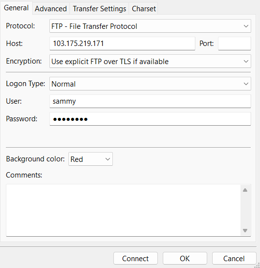

# Instalasi FTP di Ubuntu
## Installing vsftpd
```
sudo apt install vsftpd
```
```
sudo cp /etc/vsftpd.conf /etc/vsftpd.conf.orig
```

## Opening the Firewall
```
sudo ufw allow 20,21,990/tcp
```
Next, open ports 40000-50000 for the range of passive ports you will be setting in the configuration file:
```
sudo ufw allow 40000:50000/tcp
```

```
sudo ufw status
```


## Preparing the User Directory
create user
```
sudo adduser user1
```

Create the ftp folder:
```
sudo mkdir /home/user1/ftp
```

Set its ownership:
```
sudo chown nobody:nogroup /home/user1/ftp
```

Remove write permissions:
```
sudo chmod a-w /home/user1/ftp
```

Verify the permissions:
```
sudo ls -la /home/user1/ftp
```
Next, create the directory for file uploads:
```
sudo mkdir /home/user1/ftp/files
```
Then assign ownership to the user:
```
sudo chown user1:user1 /home/user1/ftp/files
```

Finally, add a test.txt file to use for testing:
```
echo "Hello, this is file example" | sudo tee /home/user1/ftp/files/test.txt
```


## Configuring FTP Access
```
sudo nano /etc/vsftpd.conf
```
Cari dan edit menjadi seperti berikut:
(yang ada diubah, yang belum ada di update)
```
anonymous_enable=NO
local_enable=YES
write_enable=YES
chroot_local_user=YES

user_sub_token=$USER
local_root=/home/$USER/ftp

userlist_enable=YES
userlist_file=/etc/vsftpd.userlist
userlist_deny=NO
```

Finally, add your user to /etc/vsftpd.userlist. Use the -a flag to append to the file:
```
echo "user1" | sudo tee -a /etc/vsftpd.userlist
```
```
cat /etc/vsftpd.userlist
```

Restart the daemon to load the configuration changes:
```
sudo systemctl restart vsftpd
```

## Testing FTP Access
```
ftp -p 203.0.113.0
```

## Securing Transactions

```
sudo openssl req -x509 -nodes -days 365 -newkey rsa:2048 -keyout /etc/ssl/private/vsftpd.pem -out /etc/ssl/private/vsftpd.pem
```
```
sudo nano /etc/vsftpd.conf
```
Ubah menjadi sepert ini
```
rsa_cert_file=/etc/ssl/private/vsftpd.pem
rsa_private_key_file=/etc/ssl/private/vsftpd.pem
ssl_enable=YES

allow_anon_ssl=NO
force_local_data_ssl=YES
force_local_logins_ssl=YES

ssl_tlsv1=YES
ssl_sslv2=NO
ssl_sslv3=NO

require_ssl_reuse=NO
ssl_ciphers=HIGH

allow_writeable_chroot=YES
pasv_enable=Yes

pasv_min_port=40000
pasv_max_port=50000
```
Restart
```
sudo systemctl restart vsftpd
```
## Finish


