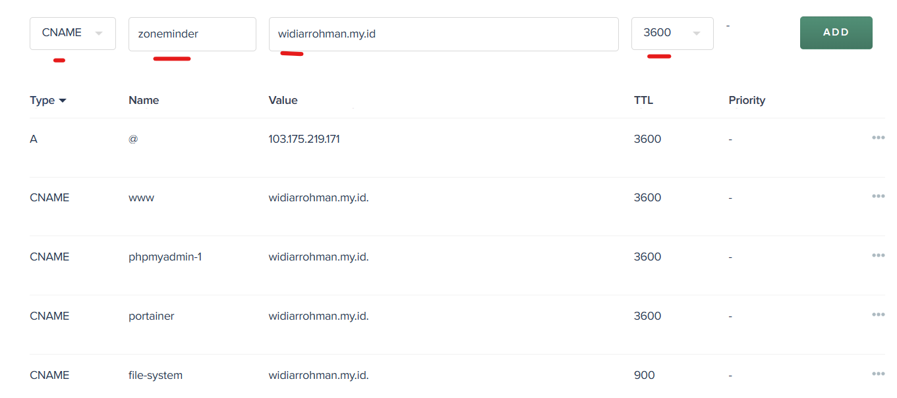
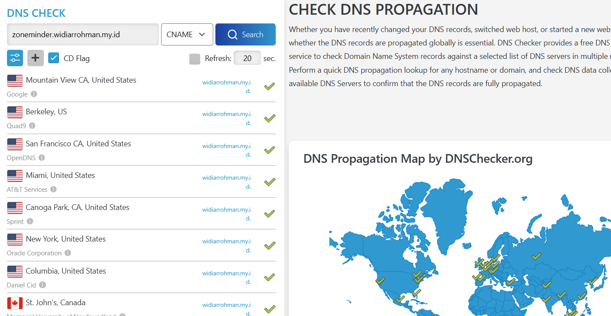
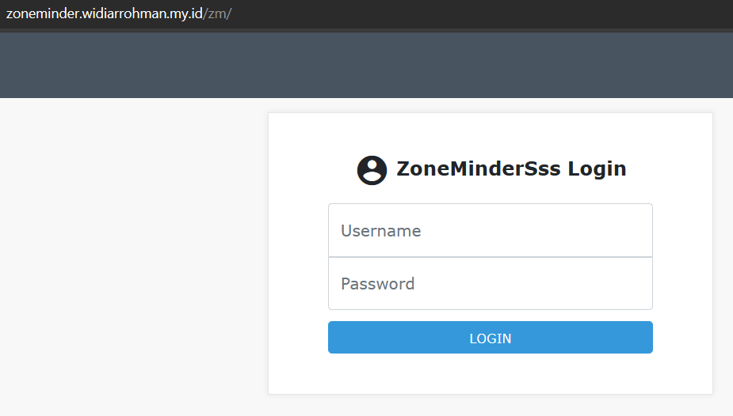

# Instalation and configuration nginx in ubuntu

## Instalation with docker
- lorem ipsum dolor sit amet, culametan met met.

## Setting sub domain in nginx
1. login docker exec
    ```Docker
    docker exec -it nginx-1 bash
    ```
1. 
    ```
    cd /etc/nginx/conf.d
    ```
1. copy file default configuration to the file subdomain to be created. in this case, I using zoneminder.
    ```
    cp default.conf zoneminder.conf
    ```
1. open and edit file `zoneminder.conf`
    ```linux
    nano zoneminder.conf
    ```
1. after and before file `zoneminder.conf`
    - after
    ```linux
    server {
        listen 80;
        server_name 103.175.219.171;

        location / {
            root /usr/share/nginx/html;
            index index.html;
        }
    }
    ```
    - before
    ```linux
    server {
        listen 80;
        server_name zoneminder.widiarrohman.my.id;

        location / {
            proxy_pass http://103.175.219.171:1080;
            proxy_set_header Host $host;
            proxy_set_header X-Real-IP $remote_addr;
        }
    }
    ```
1. save and close
    - `ctrl+x`
    - `y`
    - `enter`

1. exit from exec and restart docker nginx
    ```
    docker restart nginx-1
    ```

1. enable firewall
    ```
    ufw allow 1080
    ```
    1080 is port zoneminder


1. Setting domain record in Biznet cloud
        

1. Check sub domain in [DNS Checker](https://dnschecker.org/)

    

1. access subdomain
    

1. and voilla.... you can sleep well    