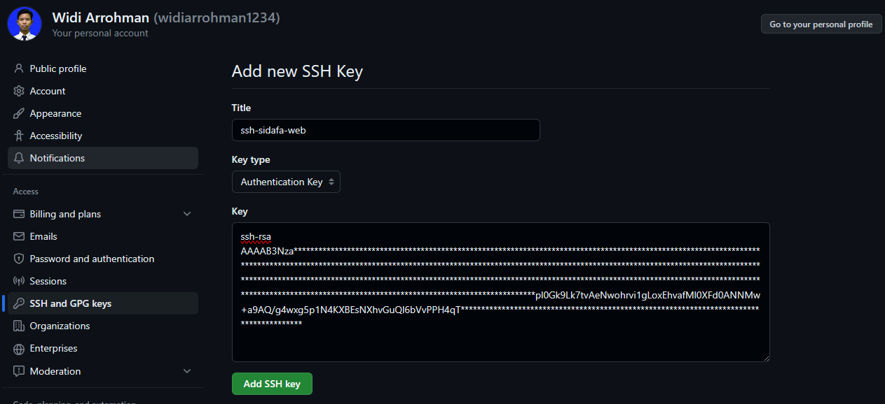

# clone repo private using SSH in Ubuntu
## buat ssh
```
root@vps-sidafa:/home/sidafa/ssh# ssh-keygen
Generating public/private rsa key pair.
Enter file in which to save the key (/root/.ssh/id_rsa): /home/sidafa/ssh/sidafa-web
Enter passphrase (empty for no passphrase): ******
Enter same passphrase again: ******
Your identification has been saved in /home/sidafa/ssh/sidafa-web
Your public key has been saved in /home/sidafa/ssh/sidafa-web.pub
The key fingerprint is:
SHA256:R21rNJF34MByqRMTcC+2O7kp2ee9+mB/qF1XFC9Yn/Q root@vps-sidafa
The key's randomart image is:
+---[RSA 3072]----+
|        ..ooooo+ |
|         .+o=*o.*|
|          +*B.ooE|
|         oo= o o |
|        S o.o   .|
|         . +    .|
|         o+ o  .o|
|        o .=.=..o|
|         .oo++*o |
+----[SHA256]-----+
```

## ssh sudah jadi
- `sidafa-web` adalah kunci private **TIDAK BOLEH DI BAGIKAN**
- `sidafa-web.pub` adalah kunci public **YANG AKAN DI BAGIKAN**
```
root@vps-sidafa:/home/sidafa/ssh# ls
sidafa-web  sidafa-web.pub
```

## Ambil kunci public dan daftarkan ke github.com
```
root@vps-sidafa:/home/sidafa/ssh# cat sidafa-web.pub
ssh-rsa AAAAB3NzaC**********
```
daftarkan kesini



## lakukan cloning
```
root@vps-sidafa:/home/sidafa/ssh# cd /var/www
root@vps-sidafa:/var/www# eval "$(ssh-agent -s)"
Enter passphrase for /home/sidafa/ssh/sidafa-web: ******
Identity added: /home/sidafa/ssh/sidafa-web (root@vps-sidafa)

root@vps-sidafa:/var/www# chmod 700 /home/sidafa/ssh
root@vps-sidafa:/var/www# ssh-add /home/sidafa/ssh
root@vps-sidafa:/var/www# ssh -T git@github.com
Hi widiarrohman1234! You've successfully authenticated, but GitHub does not provide shell access.

root@vps-sidafa:/var/www# git clone git@github.com:widiarrohman1234/sidafa-web.git
```
## Auto terdaftar ke Agent pid
```
nano .bashrc
# Start the ssh-agent
eval "$(ssh-agent -s)"
# Add the SSH key
ssh-add .ssh/id_rsa
ssh -T git@github.com

source .bashrc
```

## selesai
