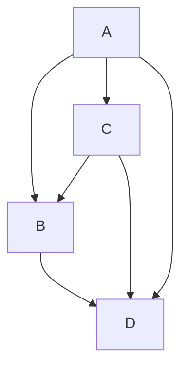
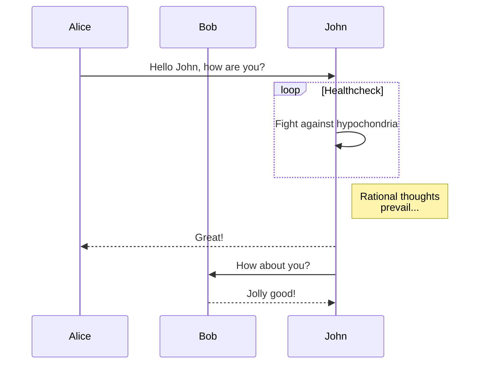
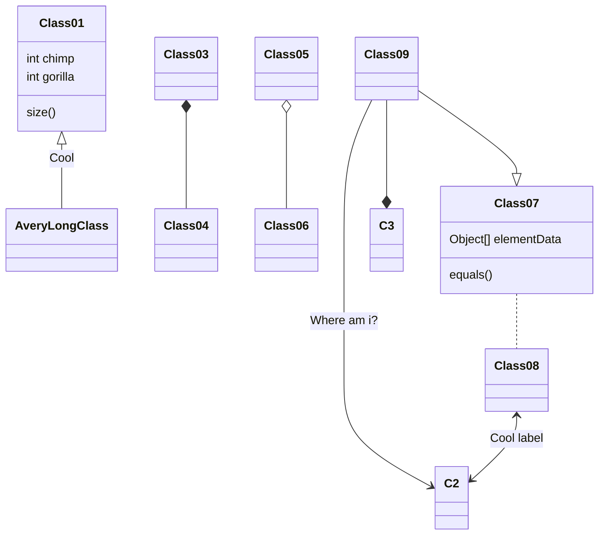
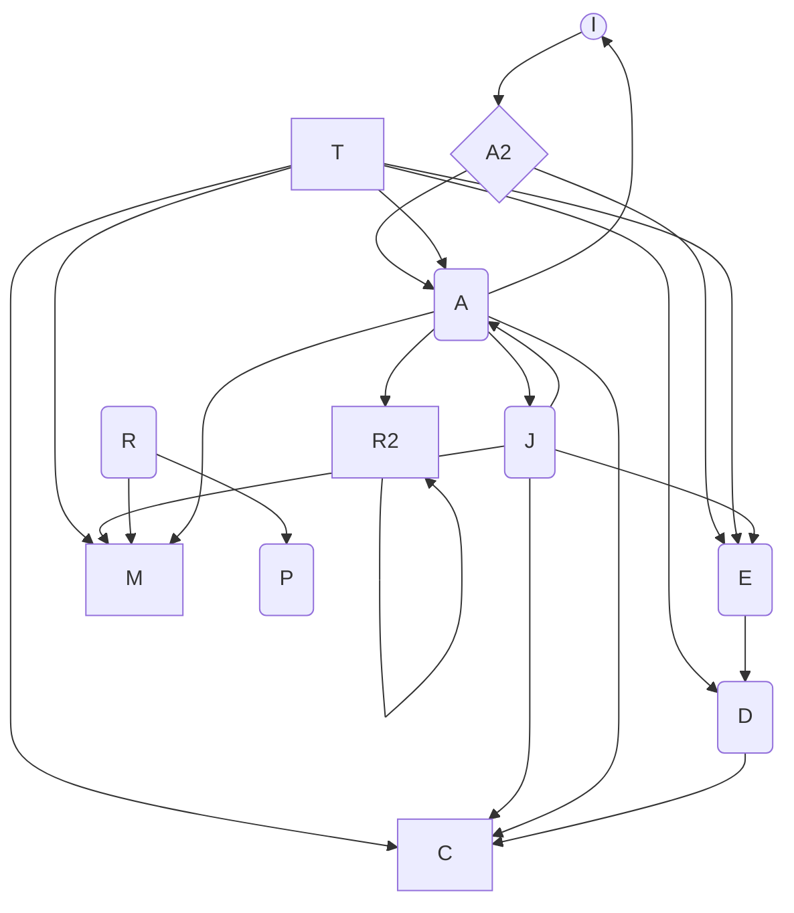

```mermaid
graph TD;
    A-->B;
    A-->C;
    B-->D;
    C-->D;
    A-->D;
    C-->B;
```

```mermaid
sequenceDiagram
    participant Alice
    participant Bob
    Alice->>John: Hello John, how are you?
    loop Healthcheck
        John->>John: Fight against hypochondria
    end
    Note right of John: Rational thoughts <br/>prevail...
    John-->>Alice: Great!
    John->>Bob: How about you?
    Bob-->>John: Jolly good!
```

```mermaid
classDiagram
Class01 <|-- AveryLongClass : Cool
Class03 *-- Class04
Class05 o-- Class06
Class07 .. Class08
Class09 --> C2 : Where am i?
Class09 --* C3
Class09 --|> Class07
Class07 : equals()
Class07 : Object[] elementData
Class01 : size()
Class01 : int chimp
Class01 : int gorilla
Class08 <--> C2: Cool label
```

```mermaid
graph TD
I((I))-->A2{A2}
A2 --> E(E)
A2 --> A(A)
T[T] --> C[C]
T --> M[M]
T --> E(E)
T --> D(D)
T --> A
J(J) --> C
J --> M
J --> A
J --> E
R(R) --> M
R --> P(P)
A --> I
A --> J
A --> R2[R2]
A --> C
A --> M
E --> D
D --> C
R2 --> R2
```